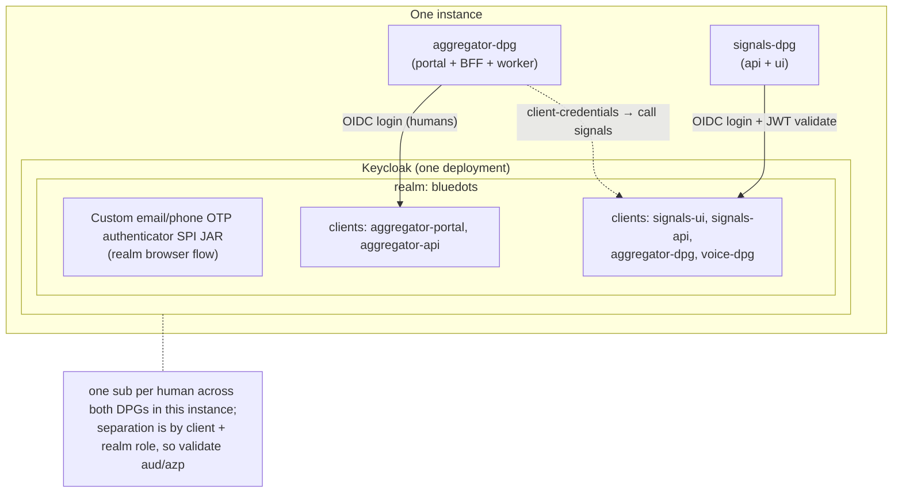
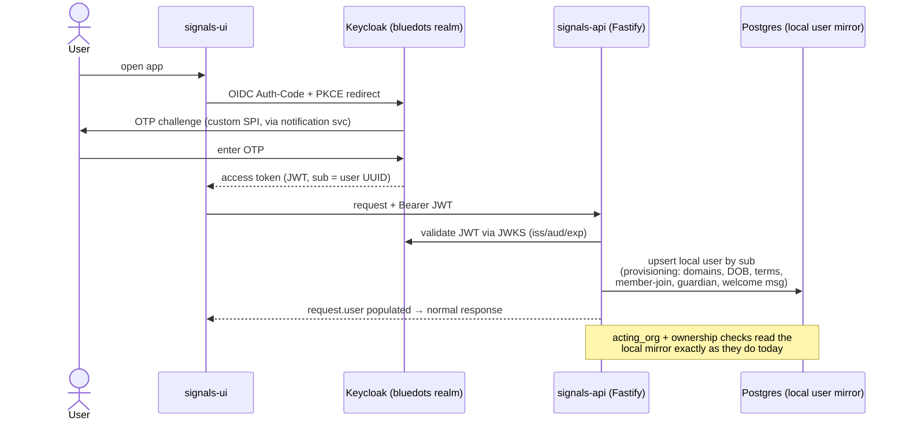

# Design: Replace better-auth with Keycloak in signals-dpg

**Status:** Draft for review
**Date:** 2026-07-23
**Author:** Engineering (with Claude Code)

> Point-in-time design record. When this plan and the code disagree later, the code wins.

---

## 1. Context & goal

### Goal
Standardize signals-dpg's identity on **Keycloak — the same identity technology the rest of the ecosystem already uses** — with signals and aggregator sharing **one Keycloak deployment and one realm per instance**. Today aggregator-dpg authenticates its human users against Keycloak (realm `aggregator`, OIDC Authorization-Code + PKCE, with a custom email/phone OTP authenticator SPI). signals-dpg runs its own, separate identity system built on **better-auth**. This design moves signals-dpg onto that same Keycloak so that:

- Both DPGs in an instance run against **one Keycloak deployment and one shared realm**, `bluedots`. Separation between the two DPGs is by **client and realm role**, not by realm. One Keycloak, one realm, many clients — per instance.
- Service-to-service auth between DPGs moves to a standard OAuth2 mechanism (client-credentials) instead of the bespoke `x-api-key` scheme.

> **Realm scoping note.** A Keycloak `sub` is unique *per realm*. Because signals and aggregator share an instance's realm, the same human is **one subject with one `sub` across both DPGs in that instance**, and `sub` equals the migrated user UUID (§6). Because the realm is per instance, `sub` is **not** shared across instances — the realm boundary matches the instance boundary, which is also where signals' own `user` table and its `email`/`phone_number` uniqueness already sit. The corollary within an instance: that uniqueness now spans both DPGs' user populations (§6.3).

### Decisions locked before this draft
1. **Full replacement**, not a partial/hybrid — better-auth is removed from the tree at the end.
2. **Service auth migrates too** — the `x-api-key` + `x-acting-org-id` contract used by aggregator-dpg and voice-dpg moves to Keycloak client-credentials. This is a coordinated multi-repo change.
3. **Live users exist** — a real user migration is required; cutover must be phased and reversible, not a clean wipe.

### Guiding principle
**Signals-dpg keeps its local `user` / `organization` / `member` tables as a Keycloak-synced mirror**, preserving the existing user UUIDs. We do *not* repoint domain data to a new ID space. This is the single most important risk-reducing decision — see §2.3 for why.

### In scope
- Human login (UI) → Keycloak OIDC.
- Service auth (integrating DPGs) → Keycloak client-credentials.
- Removal of better-auth (`better-auth`, `@better-auth/api-key`) and the custom `unified_otp` plugin.
- User + org + service-account data migration into Keycloak.

### Out of scope (explicitly unchanged)
- **Inter-instance HMAC peer auth** (`peer_instance_guard.ts`, `utils/instance_token.ts`) — entirely independent of better-auth; not touched.
- **PII crypto** (`packages/auth/src/pii_crypto.ts`, `pii_key.ts`) — lives in `packages/auth` but has no better-auth dependency; it stays (the package survives, only its better-auth content is removed).
- The bespoke **acting-org** capability model (`organization.type` gating) — the mechanism stays; only how the underlying rows are populated changes.

---

## 2. Current-state map

### 2.1 Three auth surfaces (separate them — they migrate differently)

better-auth (`v1.6.11`, `packages/auth/package.json:24-29`) lives **entirely on the backend**. The UI has no better-auth SDK — it is a hand-rolled axios client (`apps/ui/src/lib/api-client.ts:6-24`) hitting better-auth's REST endpoints, storing a bearer token in `localStorage` (`apps/ui/src/lib/auth-token.ts:1-13`) plus cookies (`withCredentials: true`).

| Surface | Consumer | Mechanism today | Key files |
|---|---|---|---|
| **Human login** | UI users | Custom `unified_otp` plugin: phone/email OTP. Sessions in **Redis** `secondaryStorage` — **no session table in Postgres**. | `packages/auth/plugins/unified_otp.ts`, `packages/auth/src/config.ts:71-83` |
| **Service auth** | Integrating DPGs (aggregator, voice) | `x-api-key` via `@better-auth/api-key` → resolves to a service `user` + `x-acting-org-id` acting org | `apps/api/plugins/auth/auth_middleware.ts:15-61`, `packages/auth/src/config.ts:12-22,238` |
| **Peer auth** | Signals instance ↔ instance | Custom HMAC token — **no better-auth** | `apps/api/src/middleware/peer_instance_guard.ts`, `apps/api/src/utils/instance_token.ts` |

**All better-auth calls in app code** (the full surface to replace):
- `authInstance.api.verifyApiKey(...)` — `auth_middleware.ts:18-23`, `validate_api_key.ts`
- `authInstance.api.getSession(...)` — `auth_middleware.ts:66-68`, `validate_session.ts`
- `authInstance.api.signUpEmail(...)` — participant onboarding, `apps/api/src/routes/v1/admin/participant.ts:120-126`
- `authInstance.handler(req)` — the `/api/auth/*` catch-all, `apps/api/src/routes/auth/index.ts:35` (registered `apps/api/src/server.ts:110`)

### 2.2 The identity data model

All better-auth tables live in **one file**: `apps/api/db/postgres/schema/auth.ts` — `user` (`:11`), `account` (`:60`), `verification` (`:78`), `organization` (`:91`, custom `type` column at `:98`), `member` (`:101`), `invitation` (`:114`), `team` (`:129`), `team_member` (`:139`), `apikey` (`:148`). Created by migration `apps/api/drizzle/0000_vengeful_yellowjacket.sql`.

- **User IDs are UUIDs** — `crypto.randomUUID()` (`packages/auth/src/config.ts:30-33`), stored as `text`. Keycloak also uses UUIDs, so IDs can be **preserved** on migration.
- The `admin` and `organization` better-auth plugins are **configured but their runtime APIs are never called** — the tables are read/written as plain Drizzle tables. "Acting org" is a bespoke concept (`x-acting-org-id`), not better-auth's active-org/impersonation.
- The `user` table carries heavy custom columns: `phone_number`/`phone_number_verified`, `date_of_birth`, `domains text[]`, `terms_accepted`/`privacy_accepted`, `onboarded_by_org_id`/`onboarded_via`/`onboarded_source_id`/`onboarded_at`, `tags jsonb` (`auth.ts:11-58`).

### 2.3 Blast radius — why we keep a local user mirror

The identity model is woven into domain data two ways:

**Hard FKs:**
- `items.created_by` → `user.id` **`ON DELETE RESTRICT`** (`apps/api/drizzle/0001_core.sql:26-27`) — every item is FK-bound to a user.
- `item_actions.performed_by_org_id` → `organization.id`, `item_actions.performed_by_service_user_id` → `user.id` (`0001_core.sql:77,79`).
- `user.onboarded_by_org_id` → `organization.id`; `item_metrics.onboarded_by_org_id` → `organization.id`.

**App-level `text` references (no FK, because target tables are partitioned):**
- `action_events.source_item_owner` / `target_item_owner`, `item_actions.*_item_owner`, `item_metrics.owner_user_id`, `consent_record.user_id`, `pii_reveal_audit.viewer_user_id`/`revealed_item_owner`, `minor_guardian.user_id`.

**Implication:** if the user ID space changed, we would have to rewrite these `text` columns across **all partitions** plus repoint the RESTRICT FK — a large, risky data migration. **Keeping the local `user`/`organization`/`member` tables as a mirror keyed on the (preserved) Keycloak `sub`/UUID avoids all of it.** Domain data never moves; only the *source of truth* for authentication shifts to Keycloak, with signals holding a synced projection.

---

## 3. Target architecture

### 3.1 Keycloak topology — one Keycloak, one realm, per instance

**Each instance runs one Keycloak deployment holding one realm, `bluedots`, shared by that instance's signals API and aggregator.** Separation between DPGs is by **client and realm role**, not by realm:

- **`bluedots` realm** — every human in the instance: aggregator's coordinators/aggregators *and* signals participants. It replaces today's `aggregator` realm (`aggregator-dpg/infra/keycloak/realms/aggregator-realm.json`), which must be renamed/re-imported and its existing users migrated — **aggregator-side work outside this repo**, sequenced as rollout step **R0** (§7).
- **Why one realm rather than one per DPG:** aggregator already sets `registrationAllowed: false`, exactly as signals' `gated` mode requires, and its only realm role is `org_owner`, so there is nothing to keep apart at realm level. Sharing avoids duplicating the realm, its clients, and the OTP flow config, and gives a human one `sub` across both DPGs in the instance.
- **Why per instance:** an instance is already the boundary for signals' `user` table, its Postgres, and its `email`/`phone_number` uniqueness. Making the realm match that boundary means no identity spans two databases, so the migration never has to reconcile the same human across instances.
- This is identical in **local-setup and production** — one Keycloak process, one realm. Local-setup's compose already runs a Keycloak service; this extends its realm import rather than adding a second realm.

**Signals' clients in the `bluedots` realm** (alongside the existing `aggregator-portal` / `aggregator-api`):
- `signals-ui` — public client, OIDC Authorization-Code + PKCE (mirrors aggregator's `aggregator-portal`).
- `signals-api` — confidential client / resource server; validates access tokens and holds a service account with `realm-management` roles (`manage-users`) for the provisioning sync (mirrors aggregator's `aggregator-api`).
- One confidential **client per integrating DPG** (`aggregator-dpg`, `voice-dpg`) for client-credentials service auth (replaces their API keys).

Because the realm is shared, `signals-api` must validate the token's **`aud`/`azp`** and required realm role — an aggregator-issued token is now realm-valid and must not be accepted as a signals participant session on that basis alone. Realm roles are also a shared namespace: signals' roles must not collide with aggregator's existing `org_owner`.

**OTP:** reuse aggregator's custom email/phone OTP authenticator SPI JAR (`aggregator-dpg/infra/keycloak/providers/keycloak-otp-1.0.0-SNAPSHOT.jar`) — already bound as the realm's browser flow (`aggregator-otp-browser`), so signals inherits it. Biggest de-risker; we do not rebuild OTP. Note that browser flow, login theme, and email theme are **realm-scoped**: signals shares aggregator's unless per-client overrides are used (confirm against brand-specific deployments, `docs/superpowers/plans/2026-06-25-brand-specific-deployments.md`).



### 3.2 How each surface changes

| Surface | Today | Target |
|---|---|---|
| Human login | `unified_otp` plugin issues a Redis session | Keycloak OTP flow issues an OIDC token; signals validates the JWT and provisions/refreshes the local `user` mirror |
| Session validation | `authInstance.api.getSession()` | Verify Keycloak JWT (JWKS, `iss`/`aud`/`exp`); map `sub` → local `user` row |
| Service auth | `verifyApiKey()` → service `user` | Verify client-credentials JWT; map client → service `user` + acting org |
| Acting org | `x-acting-org-id` header + `organization.type` gate | **Authorised by token claim, selected by header** (§5.1). The header stays as the *selector*; the token now carries the set of orgs the caller may act for, and the API rejects anything outside it. `organization`/`member` rows still read locally |
| Peer auth | HMAC | **Unchanged** |

### 3.3 The `request.user` / `request.acting_org` contract is preserved
`apps/api/types.d.ts` declares `request.user` (`:5-11`) and `request.acting_org` (`:31-35`). **These stay identical.** Only the middleware that *populates* them changes: instead of `getSession`/`verifyApiKey`, the middleware validates a Keycloak JWT and resolves the local mirror row. Everything downstream (`acting_org.ts`, admin routes, ownership checks keyed on `user.onboarded_by_org_id`) is unaffected because it reads `request.user`/`request.acting_org`, never better-auth directly.

### 3.4 User mirror & provisioning
- The local `user` table stays, minus better-auth-only columns (`account`, `verification` tables are dropped; password/credential columns become Keycloak's responsibility).
- On **first successful login** (and on a periodic/webhook sync), signals upserts the local `user` row from Keycloak claims (`sub` → `id`, email, phone, and — critically — the signals-specific attributes: `domains`, `date_of_birth`, `terms_accepted`, onboarding attribution, `tags`).
- Signals-specific attributes (`domains`, `date_of_birth`, onboarding fields, `tags`) stay **authoritative in the local `user` table**; Keycloak owns identity + credentials + coarse authz. Full ownership split and rationale in §6.

**Human login + first-login provisioning (target flow):**



---

## 4. The hard part — relocating `unified_otp` business logic

`unified_otp` is **authentication married to onboarding business logic**. Keycloak's OTP SPI handles the *credential* half cleanly; the *business* half must move into signals app-side services triggered at provisioning/first-login. This is where most effort and risk live — not token validation.

What `unified_otp.ts` does today, and where each piece goes:

| Current behavior (`unified_otp.ts`) | Target home |
|---|---|
| `checkUser` existence check (`:154-242`) | Keycloak (user-exists) + local mirror check; UI calls a signals endpoint that queries Keycloak/mirror |
| Self-signup gating `assertSelfSignupAllowed` at request **and** verify (`:334,:595`) | App-side: enforced in the provisioning hook + Keycloak realm registration policy. **The dual-call-site invariant becomes a single provisioning gate** — but registration must also be locked down in Keycloak (see risk R4) |
| Channel gating `assertChannelAllowed` (`:220,:314,:546`) | Keycloak authenticator config (which OTP channels are enabled) + app validation |
| U18 / `date_of_birth` capture | App-side onboarding step post-login, or Keycloak required-action/attribute |
| `terms_accepted` / `privacy_accepted` | Keycloak required-action (terms) or app-side onboarding step |
| Welcome email + WhatsApp, `afterUserCreate` → `materializeSignupGuardian` (`create_auth.ts:38-44`) | App-side first-login provisioning hook in signals (keep `signup_guardian.ts` logic, trigger it from provisioning instead of the better-auth callback) |
| `member` / org-join creation in `verifyOtp` (`:676-742`) | App-side provisioning (write `member` row when mirroring the user) |
| Admin-onboarded participants: `signUpEmail` (`participant.ts:120-126`) | Keycloak Admin API user-create (via `signals-api` service account), then local mirror upsert |

**Key semantic mismatch (R4):** signals defaults to `SELF_SIGNUP_MODE=gated` — public self-registration is blocked; new participants are admin-onboarded via `POST /api/v1/admin/participant`. Keycloak's model is registration-friendly. The gated model must be reproduced by **disabling self-registration in the realm** and doing all participant creation through the `signals-api` service account — otherwise the gate reopens at the Keycloak layer. `allowed` mode maps to enabling realm self-registration.

---

## 5. Service-auth migration (`x-api-key` → client-credentials)

### Today
`seed_service_users.ts` mints, per integrating DPG, an `organization` (`type=network_service`), a service `user`, a `member`, and one `apikey` row (SHA-256 hash stored, raw key printed once). Callers send `x-api-key: <raw>` + `x-acting-org-id: <org>`; `auth_middleware.ts:15-61` calls `verifyApiKey`, resolves the owning service user, sets `request.user`.

### Target
- Each integrating DPG gets a **confidential Keycloak client**; it obtains an access token via client-credentials and sends `Authorization: Bearer <token>`. The `x-acting-org-id` header **stays**, but it is no longer trusted on its own — see §5.1.
- `auth_middleware.ts` validates the JWT; a client-id → service-user/org mapping (a claim or a small local lookup) replaces the apikey → user lookup. `request.user` / `request.acting_org` shapes are unchanged.
- The `apikey` table and `@better-auth/api-key` dependency are removed.

### Cross-repo coordination (this is the multi-repo part)
- **signals-dpg:** accept bearer JWTs on the service path; keep a compatibility window where **both** `x-api-key` and bearer are accepted (flag-gated) so the three repos don't have to cut over in the same deploy.
- **aggregator-dpg:** switch its signals client from sending `x-api-key` to fetching+sending a client-credentials token. aggregator already speaks Keycloak, so it has the machinery.
- **voice-dpg:** same change.
- Contract doc `docs/operations/integrating-dpgs.md` must be rewritten (the two-header table at `:17-25`, the seed instructions at `:57-78`).

### 5.1 Acting org: from unverified header to token claim

*Added 2026-07-29, superseding this document's earlier "acting-org is orthogonal
to authentication, the header just stays" position.*

#### The problem with the header as it stands

`acting_org_preHandler` (`apps/api/src/middleware/acting_org.ts`) validates three
things about `x-acting-org-id`: the header is present, the org exists, and the
org's `type` is one of `aggregator` | `voice` | `network_service`. It then checks
that the caller is a member of **some** org:

```ts
.from(member).where(eq(member.userId, service_user_id)).limit(1)
```

**Membership of the *asserted* org is never checked.** Any authenticated service
user who is a member of any one org can assert any other org's id. That matters
because `participant_decrypt.ts:146` scopes decrypted PII by
`user.onboardedByOrgId == acting.org_id` — so a caller asserting another
aggregator's org id reads that aggregator's participants' decrypted profiles.

Today this is held together by trust: the integrating DPG is documented as a
"trusted intermediary". The bearer migration is the right moment to replace that
trust with something the API can verify, because a JWT can carry a claim the
caller cannot forge whereas a header is entirely caller-controlled.

#### Why a pure claim cannot replace the header

A claim is fixed at token-mint time. Whether that works depends on the caller,
and the three callers differ:

| Caller | Where the acting org comes from today | Fixed per token? |
|---|---|---|
| Human coordinator (aggregator portal) | `signalstack_org_id` Keycloak **user attribute**, already mapped into aggregator's tokens | **Yes** — one org per human |
| aggregator-dpg service, aggregator upserts | `SIGNALSTACK_ACTING_ORG_ID`, fixed per deployment | **Yes** — one platform org per client |
| aggregator-dpg service, worker + anonymous link submissions | `signalstackOrgId` read **per call** from the coordinator's row | **No** — varies per request |

The third row is the blocker. A single service credential deliberately serves
many aggregators; that is the intermediary model the contract doc describes.
Making the acting org a static client claim would require either one Keycloak
client per aggregator — unworkable, since aggregators are created dynamically
via `POST /api/v1/admin/aggregator/upsert` — or RFC 8693 token exchange to mint
a per-org token on each switch.

#### Decision: the claim is the boundary, the header is the selector

- **The token carries `signals_acting_orgs`** — the set of org ids this caller
  may act for. For a human it is the single org from their user attribute. For a
  service client it is the allowlist that client is entitled to.
- **The header still selects** which of those orgs a given request acts for, and
  the API **rejects any header value not in the claim**.
- **When the claim names exactly one org and no header is sent**, that org is
  used. This is what lets human callers drop the header entirely.
- A platform-wide `network_service` client may carry `signals_acting_orgs: ["*"]`
  to preserve today's behaviour for the one caller that genuinely needs it. That
  wildcard is an explicit, auditable grant rather than an unstated default.

This closes the hole above without breaking the intermediary model, and it is
strictly stronger than today at every step: an assertion outside the grant is now
rejected, where previously it was honoured.

Should the header be removed entirely later, the path is token exchange (below),
not per-aggregator clients.

#### Where the claim comes from

- **Human tokens:** a `oidc-usermodel-attribute-mapper` on `signals-ui`, reading
  the same `signalstack_org_id` user attribute aggregator's realm already maps.
  No new data — the attribute exists and is already populated by aggregator's
  approval flow.
- **Service tokens:** a hardcoded-claim mapper on each integrating DPG's client,
  or `signals_acting_orgs: ["*"]` for `network_service`. Claims on a
  client-credentials token come from the client, so this is realm config, not
  per-request data.

#### Rollout flag

`ACTING_ORG_SOURCE` (`header` | `claim_preferred` | `claim_required`), mirroring
`AUTH_PROVIDER`'s shape so this can land inert and be flipped per instance:

- `header` — today's behaviour exactly. Default; safe to merge.
- `claim_preferred` — the claim is enforced **when present**; a token without one
  falls back to the header. This is the compatibility window: aggregator and
  voice can adopt claims independently.
- `claim_required` — a token with no `signals_acting_orgs` is rejected on any
  acting-org route. Terminal state.

#### What does not change

`request.acting_org`'s shape (`org_id`, `org_type`, `service_user_id`) is
unchanged, so every route, the `organization.type` capability gate, and the
ownership joins in `participant_decrypt` are untouched. `organization` / `member`
stay local and authoritative (§6.4) — this decision does **not** model orgs as
Keycloak groups; it only carries an *authorisation grant* in the token. That
answers open question 3 with "keep them local, but let the token bound which of
them a caller may assert."

---

## 6. User migration

### 6.0 The decision: the `user` table stays; Keycloak becomes the identity source

*Ownership model:* **Keycloak owns authentication identity (credentials, login, verification, coarse authz); the signals `user` table stays as the domain projection.** We do **not** move users fully into Keycloak. Migration creates an *identity shell* in Keycloak keyed on the **same UUID** as the existing `user.id` — it does not relocate the row.

#### Why the table cannot move fully to Keycloak (3 hard blockers)
1. **Hard FK with `ON DELETE RESTRICT`.** `items.created_by → user.id` (`apps/api/drizzle/0001_core.sql:26-27`), plus `item_actions.performed_by_service_user_id → user.id` (`:79`) and the `organization` FKs. A Postgres FK requires the referenced table to exist in the same DB; dropping `user` drops these constraints and the creator-integrity guarantee.
2. **SQL joins that are a security boundary.** `participant_decrypt.ts:141,164` joins `items ⋈ user ON user.id = items.created_by` and filters `WHERE user.onboardedByOrgId = acting.org_id` — an aggregator may only decrypt profiles of users it onboarded. This join cannot span Postgres → Keycloak; moving `user` out turns it into per-row Admin-API calls (N+1, rate-limited, non-transactional) on a security-critical path.
3. **Attribute-filtered / aggregate / array / jsonb queries.** ~16 read sites, e.g. aggregator `dashboard.ts`/`export.ts` aggregate by `onboardedByOrgId`; `consent/get_consent_status_by_identifier.ts` looks up by email/phone; `user_domains.ts` reads `domains text[]` for profile-creation gating; `tags` uses a GIN `@>` containment index (`is_test` bulk cleanup). Keycloak's user-attribute search supports none of these efficiently.

Also: an indexed PK lookup would become a network round-trip, and `domains`/`onboarding_*`/`tags` are **domain data, not identity data**.

*Consequence — the table is still written, by new code paths:* first-login provisioning upserts the mirror; admin onboarding (`participant.ts`, today `signUpEmail`) becomes "Keycloak Admin create + local upsert"; `user_domains.ts` still writes `domains`.

### 6.1 Field-by-field mapping (join key: `keycloak user.id == sub == signals user.id`)

| signals `user` column (`auth.ts:11-58`) | Keycloak home | Authoritative | Notes |
|---|---|---|---|
| `id` (UUID) | user id / `sub` | **shared** | preserved on migration — the linchpin (§6.3) |
| `email` (unique) | `email` | **Keycloak** | login identifier; **mirrored local** (consent + `resolve_owner` read it) |
| `email_verified` | `emailVerified` | **Keycloak** | set `true` on migration for already-verified users |
| `phone_number` (unique) | attribute `phoneNumber` | **Keycloak** | OTP login identifier; **mirrored local** |
| `phone_number_verified` | attribute | **Keycloak** | |
| `name` | `firstName`/`lastName` | Keycloak (mirror local) | |
| `role` | realm role | **Keycloak** | replaces admin-plugin `role` |
| `banned` / `ban_reason` / `ban_expires` | `enabled=false` + attrs | **Keycloak** | `enabled = !banned` |
| `date_of_birth` | (opt. attribute) | **signals-local** | drives U18 logic + `u18_precheck.ts` |
| `domains text[]` | — | **signals-local** | `user_domains.ts` profile-creation gating |
| `terms_accepted` / `privacy_accepted` | Keycloak required-action | signals-local record | |
| `onboarded_by_org_id` / `_via` / `_source_id` / `_at` | — | **signals-local** | FK → `organization`, `user_onboarded_by_org_via_idx`, aggregator scoping — **must stay local** |
| `tags jsonb` | — | **signals-local only** | ops markers, GIN-indexed; never in Keycloak |
| `created_at` / `updated_at` | timestamps | both | |

**Split principle:** Keycloak owns identity + credentials + coarse authz; signals owns everything it must query, join, aggregate, or FK on, plus a mirror of email/phone/name/role for local reads.

### 6.2 Migration execution approach — scripted Admin REST bulk-create + JIT safety net

Because login is **passwordless OTP**, there are effectively **no credentials to migrate** — the job is only to create each identity shell with the right `id`, attributes, and verified flags.

- **Primary (bulk pre-load):** a script iterates existing `user` rows and creates each in Keycloak via the Admin REST API through the `signals-api` service account, setting the **preserved UUID**, `email`/`emailVerified`, phone attributes, `enabled = !banned`, and realm role. Idempotent (re-runnable), with a **dry-run/reconcile mode** that reports any `user.id` lacking a Keycloak match. Runs during the `dual` window (rollout step R4) so old + new coexist.
- **Safety net (JIT):** if a user reaches login without a Keycloak account (straggler / created between pre-load and cutover), match them by email/phone and create the Keycloak shell **with their existing UUID** on the fly. JIT is a backstop, not the primary path — users who never log in are still pre-loaded by the bulk script so admin queries stay complete.
- **Credentials:** none to rehash. Confirm no real password accounts exist in `account` before relying on this (risk R6). Users simply do a fresh OTP login against Keycloak.

### 6.3 Critical spikes to verify *before* writing migration code

1. **UUID preservation (linchpin, version-sensitive).** The whole non-destructive strategy needs `keycloak user.id == existing user.id` so `sub` matches every `created_by`/owner column. **Keycloak's plain `POST .../users` has historically ignored a client-supplied `id`** (server-generated), whereas **`partialImport` reliably honors an explicit `id`.** Spike this on the target version (aggregator runs `26.5.5`): if create honors `id`, keep Approach A as-is; **if not, the bulk path falls back to `partialImport`** while keeping the same field mapping. This is the #1 pre-implementation spike.
2. **Participant/operator collision inside the instance.** Because the realm boundary matches the instance boundary, no identity spans two databases and there is nothing to reconcile across instances. One case remains: a signals participant whose `email` / `phone_number` already exists in the realm as an aggregator user is *already* a Keycloak subject with aggregator's `sub`, so they cannot be created with signals' `user.id`. Query the existing realm against signals' `user` rows before migration and confirm zero overlap. Where an overlap exists, that user's `created_by` rows cannot be rewritten (§2.3), so the mapping needs an explicit decision rather than a default.
3. **Verified flags.** Set `emailVerified` / phone-verified `true` for already-verified users so cutover does not force everyone to re-verify.

### 6.4 Organizations, members, service accounts — kept local
`organization`/`member` stay **local and authoritative** — acting-org gating (`acting_org.ts`) and ownership checks read them via Drizzle, and they carry the `organization.type` capability model. They are **not** modeled as Keycloak groups/roles. Service accounts: each integrating DPG's Keycloak *client* maps to its existing service `organization`/`user` rows (§5).

### 6.5 Local schema changes
- Drop `account`, `verification` (better-auth credential tables).
- Drop `apikey` after service-auth cutover.
- `user` table: drop the columns that become Keycloak-authoritative-only if any are truly unused locally (audit first — email/phone/name/role are **mirrored, not dropped**); keep all signals domain columns. A migration in `apps/api/drizzle/` (next number after `0004`).
- Per `.claude/rules/database-conventions.md`: generated migrations are never hand-edited (change the schema file, then `pnpm db:generate:api`); the ledger is append-only.

---

## 7. Rollout plan — two tracks

This plan separates **implementation** (code written, merged, deployed — but inert) from **production rollout** (operator-driven switches, the data migration, and the cross-repo cutover that actually change live behavior). The two run on different clocks: almost all implementation ships to production while changing nothing for users, gated behind a flag.

**The flag:** `AUTH_PROVIDER` (`betterauth` | `dual` | `keycloak`), added to `packages/config/src/secrets.ts` **and** `turbo.json` `globalPassThroughEnv` (per `.claude/rules/env-vars.md`). It is the single rollback lever for the entire rollout up to the terminal step.

**Rule of thumb:**
- Implementation runs continuously through **Build 0 → 4**, and every piece is safe to merge and deploy to production because it is flag-gated or a not-yet-run script.
- **Build 5 (removal) is the one destructive change** — it deletes better-auth and drops tables, removing the rollback path. Its *code* may be written early, but it must **not be merged until the final rollout step**.
- Production rollout is the ordered operator sequence **R0 → R8**; each step is reversible until R8. **R0 is aggregator-side and blocks everything after it.**

---

### Track A — Implementation (build & merge)

Additive, flag-gated work. Merging any of Build 0–4 to `main` and deploying it leaves production on better-auth and users unaffected (`AUTH_PROVIDER=betterauth`).

#### Build 0 — Foundation (inert)
- Add signals' clients to the shared `bluedots` realm in Keycloak (local-setup compose already runs Keycloak; extend the existing realm import rather than adding a second realm — see §3.1). Renaming `aggregator` → `bluedots` and migrating its users is aggregator-side work that must land first — rollout step **R0**.
- Add Keycloak JWT-validation utility + JWKS caching in `apps/api`.
- Add the `AUTH_PROVIDER` config (default `betterauth` — nothing changes yet).
- **Files:** `packages/config/src/secrets.ts`, `turbo.json`, new `apps/api/src/utils/keycloak_token.ts`, Keycloak realm export under a new `infra/keycloak/` in signals (mirroring aggregator's layout).
- **Merge safety:** fully inert. ✅ deployable to prod.

#### Build 1 — Dual session validation + provisioning service (dormant)
- `auth_middleware.ts` session path: if the bearer token is a Keycloak JWT, validate it and resolve/provision the local `user` mirror; else fall back to `getSession`. Active only when `AUTH_PROVIDER=dual`.
- Implement the **provisioning service** (first-login upsert of the `user` mirror + `member` + guardian materialization) — the relocated `unified_otp` business logic (§4). This is the core work item (R1).
- **Files:** `apps/api/plugins/auth/auth_middleware.ts`, `validate_session.ts`, new `apps/api/src/services/auth/provisioning.ts`, reuse `apps/api/src/services/signup_guardian.ts`.
- **Merge safety:** dormant unless flag = `dual`/`keycloak`. ✅ deployable to prod.

#### Build 2 — UI login via Keycloak OIDC (behind UI toggle)
- UI gains the OIDC Auth-Code+PKCE redirect flow (aggregator's `apps/web` is the reference), not yet the default login screen.
- Keep the token where the axios client already reads it (`auth-token.ts`) to minimize churn, or move to cookie-only (§10, decision 4).
- **Files:** `apps/ui/src/lib/auth-api.ts`, `apps/ui/src/contexts/auth-context.tsx`, `apps/ui/src/pages/auth/login-page.tsx`, `otp-page.tsx`, `apps/ui/src/lib/api-client.ts`. Add an OIDC client lib dep.
- **Merge safety:** old OTP screens remain the default. ✅ deployable to prod.

#### Build 3 — Dual-accept service auth (additive)
- signals accepts **both** `x-api-key` and client-credentials bearer on the service path (compatibility window). No path removed yet.
- **Files:** `apps/api/plugins/auth/auth_middleware.ts`, `validate_api_key.ts`, `docs/operations/integrating-dpgs.md` (document the new bearer option alongside the existing header).
- **Merge safety:** purely additive; existing `x-api-key` callers unaffected. ✅ deployable to prod.

#### Build 4 — User migration tooling (not yet run)
- Scripted Admin-REST bulk-create that creates Keycloak users **preserving UUIDs** (`sub` == existing `user.id`), idempotent, with a **dry-run/reconcile** mode (every `user.id` must have a Keycloak match). Plus the **JIT safety-net** path in the provisioning service for stragglers. Field mapping + spikes in §6.
- **Depends on** the UUID-preservation spike (§6.3, spike 1) — if plain create doesn't honor `id` on KC 26.5.5, the bulk path uses `partialImport` instead (same mapping).
- **Files:** new `apps/api/scripts/migrate_users_to_keycloak.ts` (dry-run + apply); JIT branch in `apps/api/src/services/auth/provisioning.ts`.
- **Merge safety:** a script that isn't executed until R4; JIT branch inert until flag = `dual`/`keycloak`. ✅ deployable to prod.

#### Build 5 — Removal (destructive — prepared, held)
- Delete `unified_otp`, `otp_delivery`, `auth_guards`, `create_auth.ts`, the `/api/auth/*` catch-all, better-auth deps. Drop `account`/`verification`/`apikey` tables (migration next after `0004`). `packages/auth` keeps only `pii_crypto`/`pii_key`. Retire the seed-apikey path in `seed_service_users.ts`.
- **Files:** `packages/auth/*`, `apps/api/src/routes/auth/*`, `apps/api/src/server.ts:110`, `apps/api/scripts/seed_service_users.ts`, both `package.json`s, new drizzle migration.
- **Merge safety:** ❌ **removes the rollback path — do NOT merge during the build track.** Its code may be written and reviewed early, but it merges/deploys only at **R8**.

---

### Track B — Production rollout (operate & cut over)

Operator-driven sequence. Each step reversible until R8. Do not advance past a gate that isn't green.

| Step | Rollout act | Reversible? | Go/no-go gate |
|---|---|---|---|
| **R0** | **Aggregator-side realm rename (prerequisite, not signals work):** rename `aggregator` → `bluedots` in `aggregator-dpg/infra/keycloak/realms/aggregator-realm.json`, re-import, carry over the `aggregator-portal` / `aggregator-api` clients, the OTP browser flow, themes, and the `org_owner` role, and migrate aggregator's existing users (preserving their Keycloak ids). Then add signals' clients to that realm. Per instance, staging first. | Yes (re-import as `aggregator`; nothing signals-side depends on it until R4) | Aggregator login green against `bluedots`; realm export is the single source of truth for both DPGs; §6.3 spike 2 check has been run and reports no email/phone overlap between aggregator users and signals `user` rows |
| **R1** | Deploy Build 0–4 to prod; flag stays `betterauth` | n/a (no change) | R0 green; code confirmed inert in prod |
| **R2** | Enable `AUTH_PROVIDER=dual` in **staging**; validate Keycloak login + provisioning + acting-org | Yes (flip to `betterauth`) | Staging green (login, U18/guardian, member-join) |
| **R3** | Enable `dual` in **production** (Keycloak tokens accepted alongside better-auth) | Yes | No error-rate/latency regression |
| **R4** | **Run user migration** into Keycloak (preserve UUIDs) | Yes (Keycloak-side only; local data untouched) | Dry-run reconciles 1:1 |
| **R5** | Cut UI login over to OIDC (canary → 100%) | Yes (revert UI default) | Login success rate holds |
| **R6** | **Cross-repo:** aggregator-dpg + voice-dpg switch to client-credentials within the dual-accept window | Yes (partners revert to `x-api-key`) | Both DPGs confirm bearer traffic, zero `x-api-key` |
| **R7** | Flip `AUTH_PROVIDER=keycloak` default; **soak** | Yes (flip back to `dual`) | Soak period clean |
| **R8** | **Merge/deploy Build 5:** remove better-auth, drop `account`/`verification`/`apikey` | **No — point of no return** | Everything above soaked in prod |

### Rollback
Every rollout step **R0–R7** is reversible — **R1–R7** by flipping `AUTH_PROVIDER` back (and, for R5/R6, reverting the UI default / partner clients), **R0** by re-importing the realm as `aggregator` on the aggregator side, which stays clean only until signals migrates users at R4. The point of no easy return is **R8** (dependency + table removal); execute it only after `keycloak` has soaked in production at R7.

---

## 8. Challenges & risks (ranked)

| # | Risk | Severity | Mitigation |
|---|---|---|---|
| **R1** | **Relocating `unified_otp` business logic** (gated signup, U18/guardian, domains, member-join, welcome notifications) is subtle and correctness-critical. | High | Build the provisioning service (§4) in Build 1 with full unit coverage *before* touching login. Port `signup_guardian` logic as-is. Treat this as the core work item. |
| **R2** | **Gated-signup gate reopening at the Keycloak layer** (R4 above) — Keycloak self-registration is on by default. | High | Disable realm registration; all participant creation via `signals-api` service account. Test that a public OIDC registration attempt is rejected in `gated` mode. |
| **R3** | **Cross-repo service-auth cutover** — three repos must stay compatible during transition. | High | Dual-accept window in signals (both `x-api-key` and bearer). Don't remove apikey until aggregator + voice confirm zero old-path traffic. |
| **R4** | **`items.created_by` RESTRICT FK + text owner columns across partitions** — any ID change is catastrophic. | High | Preserve UUIDs on import (`sub` == existing `user.id`). Domain data never rewritten. This is the design's central safeguard. |
| **R5** | **OTP rate limiting** — better-auth's global limiter is off today (`config.ts:65-67`; documented gap). Don't inherit the gap. | Medium | Keycloak brute-force detection + per-flow limits configured in the realm — actually an improvement over today. |
| **R6** | **Hidden password accounts** — `emailAndPassword.enabled: true` means a password account *could* exist. | Medium | Audit `account` table for password rows before the user migration (R4); if any real ones exist, plan a reset flow. |
| **R7** | **Session semantics change** — Redis sessions (revocable server-side) → JWTs (valid until exp). | Medium | Short access-token TTL + refresh tokens; use Keycloak session/logout + token introspection where server-side revocation matters (e.g. ban → `user.banned`). |
| **R8** | **`user.banned`/ban fields** (admin plugin) currently gate access. | Medium | Map to Keycloak `enabled=false` / disabled user; provisioning respects it. |
| **R9** | **Shared realm collapses the DPG isolation boundary** — one realm per instance means an aggregator-issued token is realm-valid against signals, realm roles share one namespace, and `email`/`phone_number` are unique across both populations. | Medium | Validate `aud`/`azp` + required realm role on every signals token path, not just signature/`iss` (§3.1). Namespace signals' realm roles away from aggregator's `org_owner`. Check the shared email/phone space before migration (§6.3, spike 2). Upside: within an instance `sub` is common across both DPGs. |
| **R10** | **`cookieCache` / cross-subdomain cookie behavior** currently tuned in `config.ts:30-63`. | Low | Re-derive cookie/redirect config for the OIDC flow; validate on the real domains. |
| **R12** | **Acting-org assertion is unverified today** — `acting_org_preHandler` checks membership of *some* org, never the asserted one, so any service caller can assert any aggregator's org id and read its participants' decrypted PII (`participant_decrypt.ts:146`). Pre-existing, not introduced by this migration. | High | Carry `signals_acting_orgs` in the token and reject any header outside it (§5.1). Land behind `ACTING_ORG_SOURCE=header`, flip to `claim_preferred` once partners emit the claim, then `claim_required`. Until then the exposure is unchanged, so this should not be treated as *created* by the migration — but it should not survive it either. |
| **R11** | **Notification coupling** — OTP delivery today goes through the notification service (`sendPhoneOtp`/`sendEmailOtp`). Keycloak's OTP SPI must reach the same delivery. | Medium | The aggregator OTP SPI already solves this; confirm it targets the same notification service/templates (`login_otp`, `basic_email`). |

---

## 9. Testing strategy

Current patterns (from `apps/api/vitest.setup.ts`, the `acting_org`/`participant` tests):
- **Unit tests** mock the DB and drive middleware directly, setting `request.user` manually — these **mostly survive unchanged** because the `request.user` contract is preserved.
- **Integration tests** seed real better-auth rows (`user`/`organization`/`member`/`apikey`) and send real `x-api-key` headers, hashing keys exactly like better-auth.

Changes:
- Replace apikey-seeding integration setup with **minting Keycloak client-credentials tokens** (or a test JWT signed by a test JWKS) — introduce a test helper that issues a valid signals JWT so integration tests exercise the new middleware end-to-end.
- Add unit tests for the **provisioning service** (the relocated `unified_otp` logic) — this is the highest-value new coverage: gated vs allowed, U18/DOB, guardian materialization, member-join, channel gating.
- Keep `auth_guards.test.ts` semantics (self-signup + channel gates) but re-home the assertions onto the provisioning path.
- No test currently creates a real better-auth *session cookie*; that gap closes naturally since JWT validation is easy to test with a signed token.
- Peer-auth and PII-crypto tests are unaffected.

---

## 10. Open questions / decisions needed

1. **Keycloak topology** — *resolved:* **one Keycloak deployment and one `bluedots` realm per instance**, shared by that instance's signals and aggregator. Separation between DPGs is by client and realm role. Same layout in local-setup and production. Rationale in §3.1; costs in R9 (token `aud`/`azp` validation becomes load-bearing, realm roles share a namespace) and §6.3 spike 2 (the email/phone space is shared between the two populations).
2. **Attribute ownership** — *resolved (§6):* signals-specific attributes (`domains`, `date_of_birth`, `terms_accepted`, onboarding attribution, `tags`) stay authoritative in the local `user` table; Keycloak owns credentials + identity claims (`sub`/email/phone/role/enabled) only, with email/phone/name/role mirrored locally for reads.
3. **Are orgs modeled in Keycloak at all** — *resolved (§5.1):* `organization`/`member` stay **purely local and authoritative**; they are not Keycloak groups or roles. What the token carries is only an *authorisation grant* — `signals_acting_orgs`, the set of org ids a caller may assert — so the acting-org gate can verify the assertion instead of trusting it. The header remains the per-request selector.
4. **Token transport in the UI / BFF** — keep bearer-in-`localStorage` (current, and what Build 2 assumes), move to secure cookies with the OIDC flow, or **fold a BFF into `signals-api`**? The BFF option is the strongest XSS posture: OIDC routes on `signals-api`, an httpOnly `sid` cookie plus a Redis token store, server-side code exchange and refresh, short access tokens with rotating refresh, RP-initiated logout — so **tokens never reach the browser**. Redis is already available (better-auth's `secondaryStorage`), but this is materially more work than Build 2 currently scopes, and it changes R5. Decide before Build 2 is sized.
5. **Server-side revocation needs** — is immediate ban/logout enforcement required (drives token TTL + introspection strategy, R7)?
6. **Ownership of the OTP SPI** — is the aggregator OTP JAR reusable as-is for the signals flow, or does it need signals-specific channel/template config? Separately: **who maintains the Java SPI artifact and the realm export** once both DPGs depend on them (they live in `aggregator-dpg/infra/keycloak/` today, and neither repo is an obvious owner)?
7. **Fallback if UUID preservation fails (§6.3, spike 1)** — there is no plan beyond `partialImport` if Keycloak will not accept a client-supplied `id`. The fallback would be to let Keycloak mint `sub`s, keep a permanent `old_uuid → sub` map, and rekey domain data with batched `UPDATE … FROM` per partition, with before/after count parity and explicit orphan-owner handling. This contradicts the §1 guiding principle and requires rewriting `items.created_by` behind an `ON DELETE RESTRICT` FK across all partitions (§2.3), so adopt it as a conscious documented plan B with a sizing/downtime call — not as an improvisation mid-rollout.
8. **Inter-instance peer auth — in or out of scope?** Declared out of scope (§1), but `PEER_AUTH_MODE` defaults to `permissive` (`packages/config/src/secrets.ts:141`), which **allows a missing token**, so the federated read path is open by default. Decide whether to close it as part of this work, enforce `PEER_AUTH_MODE=enforced` as a separate change, or leave it explicitly untouched. Note that a per-instance realm means peers do *not* share an issuer, so Keycloak tokens are not a drop-in replacement for the HMAC scheme here.
9. **OTP behaviours that must survive the move into Keycloak** — (a) `CREATE_TEST_OTP` fixed-`000000` mode with its production startup guard (`packages/config/src/secrets.ts:22,54`) is relied on by local dev and many route tests; the SPI path must preserve it or those break. (b) `LOGIN_CHANNELS` is per-instance, so a **phone-only user on an instance with no SMS provider cannot log in** — that instance must offer email OTP or the channel set must be constrained. Neither is addressed by §4's relocation table.

---

## Appendix — file inventory (what changes)

**Removed at Build 5 / R8:** `packages/auth/src/config.ts`, `packages/auth/plugins/{unified_otp,otp_delivery,auth_guards}.ts`, `packages/auth/utils/index.ts`, `apps/api/src/routes/auth/{index,create_auth}.ts`, `apps/api/plugins/auth/validate_api_key.ts`, better-auth deps in `packages/auth/package.json` + `apps/api/package.json`.

**Modified:** `apps/api/plugins/auth/auth_middleware.ts`, `validate_session.ts`, `apps/api/src/config.ts`, `apps/api/src/server.ts`, `apps/api/src/routes/v1/admin/participant.ts`, `apps/api/scripts/seed_service_users.ts`, `packages/config/src/secrets.ts`, `turbo.json`, `apps/ui/src/{lib/auth-api,lib/api-client,contexts/auth-context,pages/auth/login-page,pages/auth/otp-page}.tsx`, `docs/operations/integrating-dpgs.md`, `.claude/rules/auth-model.md`, `packages/auth/CLAUDE.md`.

**Added:** `apps/api/src/utils/keycloak_token.ts`, `apps/api/src/services/auth/provisioning.ts`, `infra/keycloak/` (realm export + config), new drizzle migration (drop `account`/`verification`/`apikey`, trim `user`).

**Unchanged:** `apps/api/src/middleware/{peer_instance_guard,acting_org}.ts`, `apps/api/src/utils/instance_token.ts`, `packages/auth/src/{pii_crypto,pii_key}.ts`, `apps/api/types.d.ts` (the `request.user`/`request.acting_org` contract).
