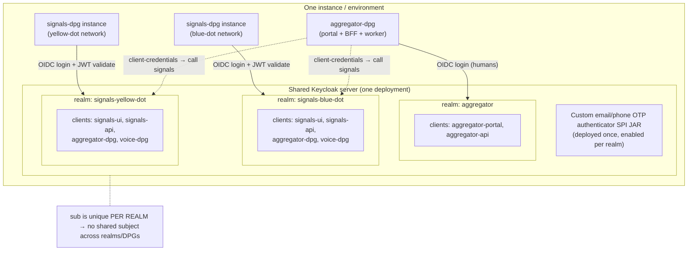
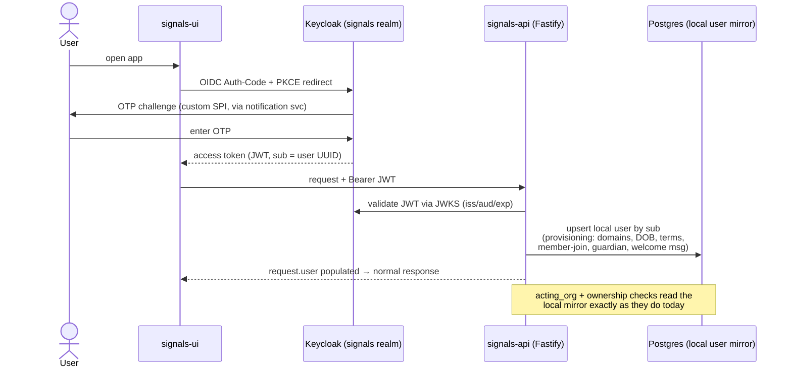
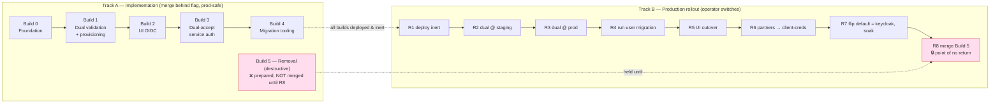

# Design: Replace better-auth with Keycloak in signals-dpg

**Status:** Draft for review
**Date:** 2026-07-23
**Author:** Engineering (with Claude Code)

> Point-in-time design record. When this plan and the code disagree later, the code wins.

---

## 1. Context & goal

### Goal
Standardize signals-dpg's identity on **Keycloak — the same identity technology the rest of the ecosystem already uses** — running on a **shared Keycloak server per instance** with signals owning its **own realm(s)**, separate from aggregator's. Today aggregator-dpg authenticates its human users against Keycloak (realm `aggregator`, OIDC Authorization-Code + PKCE, with a custom email/phone OTP authenticator SPI). signals-dpg runs its own, separate identity system built on **better-auth**. This design moves signals-dpg onto that same Keycloak so that:

- Both DPGs run against **one shared Keycloak deployment per instance/environment** — aggregator and every signals network (blue-dot, yellow-dot, …) point at the *same* Keycloak server. It is shared **infrastructure**, not a shared **realm**: each use case keeps its own realm (signals = participants; aggregator = coordinators/aggregators), because they serve different user populations. One Keycloak server, many realms.
- Service-to-service auth between DPGs moves to a standard OAuth2 mechanism (client-credentials) instead of the bespoke `x-api-key` scheme.

> **Realm scoping note.** A Keycloak `sub` is unique *per realm*, not per server. Even though signals and aggregator share the same Keycloak deployment, they use **separate realms**, so the "same" human has different `sub` values in each — there is **no shared subject identifier across DPGs**. Any future cross-DPG identity linking (e.g. the consent-service concept in `docs/superpowers/specs/2026-06-30-consent-management-minimal-v1-design.md`) would require Keycloak identity brokering/federation or an ecosystem-level user mapping, which is **out of scope here**. Within a signals realm, `sub` is stable and equals the migrated user UUID (§6).

### Decisions locked before this draft
1. **Full replacement**, not a partial/hybrid — better-auth is removed from the tree at the end.
2. **Service auth migrates too** — the `x-api-key` + `x-acting-org-id` contract used by aggregator-dpg and voice-dpg moves to Keycloak client-credentials. This is a coordinated multi-repo change.
3. **Live users exist** — a real user migration is required; cutover must be phased and reversible, not a clean wipe.

### Guiding principle
**Signals-dpg keeps its local `user` / `organization` / `member` tables as a Keycloak-synced mirror**, preserving the existing user UUIDs. We do *not* repoint domain data to a new ID space. This is the single most important risk-reducing decision — see §2.3 for why.

### In scope
- Human login (UI) → Keycloak OIDC.
- Service auth (integrating DPGs) → Keycloak client-credentials.
- Removal of better-auth (`better-auth`, `@better-auth/api-key`) and the custom `unified_otp` plugin.
- User + org + service-account data migration into Keycloak.

### Out of scope (explicitly unchanged)
- **Inter-instance HMAC peer auth** (`peer_instance_guard.ts`, `utils/instance_token.ts`) — entirely independent of better-auth; not touched.
- **PII crypto** (`packages/auth/src/pii_crypto.ts`, `pii_key.ts`) — lives in `packages/auth` but has no better-auth dependency; it stays (the package survives, only its better-auth content is removed).
- The bespoke **acting-org** capability model (`organization.type` gating) — the mechanism stays; only how the underlying rows are populated changes.

---

## 2. Current-state map

### 2.1 Three auth surfaces (separate them — they migrate differently)

better-auth (`v1.6.11`, `packages/auth/package.json:24-29`) lives **entirely on the backend**. The UI has no better-auth SDK — it is a hand-rolled axios client (`apps/ui/src/lib/api-client.ts:6-24`) hitting better-auth's REST endpoints, storing a bearer token in `localStorage` (`apps/ui/src/lib/auth-token.ts:1-13`) plus cookies (`withCredentials: true`).

| Surface | Consumer | Mechanism today | Key files |
|---|---|---|---|
| **Human login** | UI users | Custom `unified_otp` plugin: phone/email OTP. Sessions in **Redis** `secondaryStorage` — **no session table in Postgres**. | `packages/auth/plugins/unified_otp.ts`, `packages/auth/src/config.ts:71-83` |
| **Service auth** | Integrating DPGs (aggregator, voice) | `x-api-key` via `@better-auth/api-key` → resolves to a service `user` + `x-acting-org-id` acting org | `apps/api/plugins/auth/auth_middleware.ts:15-61`, `packages/auth/src/config.ts:12-22,238` |
| **Peer auth** | Signals instance ↔ instance | Custom HMAC token — **no better-auth** | `apps/api/src/middleware/peer_instance_guard.ts`, `apps/api/src/utils/instance_token.ts` |

**All better-auth calls in app code** (the full surface to replace):
- `authInstance.api.verifyApiKey(...)` — `auth_middleware.ts:18-23`, `validate_api_key.ts`
- `authInstance.api.getSession(...)` — `auth_middleware.ts:66-68`, `validate_session.ts`
- `authInstance.api.signUpEmail(...)` — participant onboarding, `apps/api/src/routes/v1/admin/participant.ts:120-126`
- `authInstance.handler(req)` — the `/api/auth/*` catch-all, `apps/api/src/routes/auth/index.ts:35` (registered `apps/api/src/server.ts:110`)

### 2.2 The identity data model

All better-auth tables live in **one file**: `apps/api/db/postgres/schema/auth.ts` — `user` (`:11`), `account` (`:60`), `verification` (`:78`), `organization` (`:91`, custom `type` column at `:98`), `member` (`:101`), `invitation` (`:114`), `team` (`:129`), `team_member` (`:139`), `apikey` (`:148`). Created by migration `apps/api/drizzle/0000_vengeful_yellowjacket.sql`.

- **User IDs are UUIDs** — `crypto.randomUUID()` (`packages/auth/src/config.ts:30-33`), stored as `text`. Keycloak also uses UUIDs, so IDs can be **preserved** on migration.
- The `admin` and `organization` better-auth plugins are **configured but their runtime APIs are never called** — the tables are read/written as plain Drizzle tables. "Acting org" is a bespoke concept (`x-acting-org-id`), not better-auth's active-org/impersonation.
- The `user` table carries heavy custom columns: `phone_number`/`phone_number_verified`, `date_of_birth`, `domains text[]`, `terms_accepted`/`privacy_accepted`, `onboarded_by_org_id`/`onboarded_via`/`onboarded_source_id`/`onboarded_at`, `tags jsonb` (`auth.ts:11-58`).

### 2.3 Blast radius — why we keep a local user mirror

The identity model is woven into domain data two ways:

**Hard FKs:**
- `items.created_by` → `user.id` **`ON DELETE RESTRICT`** (`apps/api/drizzle/0001_core.sql:26-27`) — every item is FK-bound to a user.
- `item_actions.performed_by_org_id` → `organization.id`, `item_actions.performed_by_service_user_id` → `user.id` (`0001_core.sql:77,79`).
- `user.onboarded_by_org_id` → `organization.id`; `item_metrics.onboarded_by_org_id` → `organization.id`.

**App-level `text` references (no FK, because target tables are partitioned):**
- `action_events.source_item_owner` / `target_item_owner`, `item_actions.*_item_owner`, `item_metrics.owner_user_id`, `consent_record.user_id`, `pii_reveal_audit.viewer_user_id`/`revealed_item_owner`, `minor_guardian.user_id`.

**Implication:** if the user ID space changed, we would have to rewrite these `text` columns across **all partitions** plus repoint the RESTRICT FK — a large, risky data migration. **Keeping the local `user`/`organization`/`member` tables as a mirror keyed on the (preserved) Keycloak `sub`/UUID avoids all of it.** Domain data never moves; only the *source of truth* for authentication shifts to Keycloak, with signals holding a synced projection.

---

## 3. Target architecture

### 3.1 Keycloak topology — one shared server, many realms

**One Keycloak deployment per instance/environment, shared by aggregator and all signals networks.** The separation is by **realm**, not by server:

- **`aggregator` realm** — aggregator-dpg's coordinators/aggregators (already exists today).
- **One signals realm per network** — e.g. `signals-blue-dot`, `signals-yellow-dot`, … Each network is a distinct use case with its own participant population, so it gets its own realm and its own `sub` space. *(This resolves §10 decision 1a toward per-network realms; confirm the granularity — see the note below.)*
- This is identical in **local-setup and production** — one Keycloak process, several realms. Local-setup's compose already runs a Keycloak service; this adds the signals realm import(s) alongside the existing `aggregator` one.

**Per-realm clients** (each signals realm gets its own copy of these):
- `signals-ui` — public client, OIDC Authorization-Code + PKCE (mirrors aggregator's `aggregator-portal`).
- `signals-api` — confidential client / resource server; validates access tokens and holds a service account with `realm-management` roles (`manage-users`) for the provisioning sync (mirrors aggregator's `aggregator-api`).
- One confidential **client per integrating DPG** (`aggregator-dpg`, `voice-dpg`) for client-credentials service auth (replaces their API keys).

**OTP:** reuse aggregator's custom email/phone OTP authenticator SPI JAR (`aggregator-dpg/infra/keycloak/providers/keycloak-otp-1.0.0-SNAPSHOT.jar`) — deployed once on the shared server, enabled in every signals realm's login flow. Biggest de-risker; we do not rebuild OTP.

> **Realm granularity (confirm — §10 decision 1a).** The diagram shows one realm per signals network. If instead all signals networks should share a single `signals` realm on the shared server, only the realm count changes — the client layout, provisioning, and rollout are unaffected. The shared-server decision is fixed; the per-network-vs-single-signals-realm split is the remaining open sub-decision.

### 3.2 How each surface changes

| Surface | Today | Target |
|---|---|---|
| Human login | `unified_otp` plugin issues a Redis session | Keycloak OTP flow issues an OIDC token; signals validates the JWT and provisions/refreshes the local `user` mirror |
| Session validation | `authInstance.api.getSession()` | Verify Keycloak JWT (JWKS, `iss`/`aud`/`exp`); map `sub` → local `user` row |
| Service auth | `verifyApiKey()` → service `user` | Verify client-credentials JWT; map client → service `user` + acting org |
| Acting org | `x-acting-org-id` header + `organization.type` gate | **Unchanged mechanism** — header still sent; `organization`/`member` rows still read locally (populated by sync) |
| Peer auth | HMAC | **Unchanged** |

### 3.3 The `request.user` / `request.acting_org` contract is preserved
`apps/api/types.d.ts` declares `request.user` (`:5-11`) and `request.acting_org` (`:31-35`). **These stay identical.** Only the middleware that *populates* them changes: instead of `getSession`/`verifyApiKey`, the middleware validates a Keycloak JWT and resolves the local mirror row. Everything downstream (`acting_org.ts`, admin routes, ownership checks keyed on `user.onboarded_by_org_id`) is unaffected because it reads `request.user`/`request.acting_org`, never better-auth directly.

### 3.4 User mirror & provisioning
- The local `user` table stays, minus better-auth-only columns (`account`, `verification` tables are dropped; password/credential columns become Keycloak's responsibility).
- On **first successful login** (and on a periodic/webhook sync), signals upserts the local `user` row from Keycloak claims (`sub` → `id`, email, phone, and — critically — the signals-specific attributes: `domains`, `date_of_birth`, `terms_accepted`, onboarding attribution, `tags`).
- Signals-specific attributes that Keycloak doesn't natively own are stored as **Keycloak user attributes** and/or kept authoritative in the local mirror. Decision in §10: which side owns `domains`, `date_of_birth`, onboarding fields.

**Human login + first-login provisioning (target flow):**

---

## 4. The hard part — relocating `unified_otp` business logic

`unified_otp` is **authentication married to onboarding business logic**. Keycloak's OTP SPI handles the *credential* half cleanly; the *business* half must move into signals app-side services triggered at provisioning/first-login. This is where most effort and risk live — not token validation.

What `unified_otp.ts` does today, and where each piece goes:

| Current behavior (`unified_otp.ts`) | Target home |
|---|---|
| `checkUser` existence check (`:154-242`) | Keycloak (user-exists) + local mirror check; UI calls a signals endpoint that queries Keycloak/mirror |
| Self-signup gating `assertSelfSignupAllowed` at request **and** verify (`:334,:595`) | App-side: enforced in the provisioning hook + Keycloak realm registration policy. **The dual-call-site invariant becomes a single provisioning gate** — but registration must also be locked down in Keycloak (see risk R4) |
| Channel gating `assertChannelAllowed` (`:220,:314,:546`) | Keycloak authenticator config (which OTP channels are enabled) + app validation |
| U18 / `date_of_birth` capture | App-side onboarding step post-login, or Keycloak required-action/attribute |
| `terms_accepted` / `privacy_accepted` | Keycloak required-action (terms) or app-side onboarding step |
| Welcome email + WhatsApp, `afterUserCreate` → `materializeSignupGuardian` (`create_auth.ts:38-44`) | App-side first-login provisioning hook in signals (keep `signup_guardian.ts` logic, trigger it from provisioning instead of the better-auth callback) |
| `member` / org-join creation in `verifyOtp` (`:676-742`) | App-side provisioning (write `member` row when mirroring the user) |
| Admin-onboarded participants: `signUpEmail` (`participant.ts:120-126`) | Keycloak Admin API user-create (via `signals-api` service account), then local mirror upsert |

**Key semantic mismatch (R4):** signals defaults to `SELF_SIGNUP_MODE=gated` — public self-registration is blocked; new participants are admin-onboarded via `POST /api/v1/admin/participant`. Keycloak's model is registration-friendly. The gated model must be reproduced by **disabling self-registration in the realm** and doing all participant creation through the `signals-api` service account — otherwise the gate reopens at the Keycloak layer. `allowed` mode maps to enabling realm self-registration.

---

## 5. Service-auth migration (`x-api-key` → client-credentials)

### Today
`seed_service_users.ts` mints, per integrating DPG, an `organization` (`type=network_service`), a service `user`, a `member`, and one `apikey` row (SHA-256 hash stored, raw key printed once). Callers send `x-api-key: <raw>` + `x-acting-org-id: <org>`; `auth_middleware.ts:15-61` calls `verifyApiKey`, resolves the owning service user, sets `request.user`.

### Target
- Each integrating DPG gets a **confidential Keycloak client**; it obtains an access token via client-credentials and sends `Authorization: Bearer <token>` (the `x-acting-org-id` header **stays** — acting-org is orthogonal to authentication).
- `auth_middleware.ts` validates the JWT; a client-id → service-user/org mapping (a claim or a small local lookup) replaces the apikey → user lookup. `request.user` / `request.acting_org` shapes are unchanged.
- The `apikey` table and `@better-auth/api-key` dependency are removed.

### Cross-repo coordination (this is the multi-repo part)
- **signals-dpg:** accept bearer JWTs on the service path; keep a compatibility window where **both** `x-api-key` and bearer are accepted (flag-gated) so the three repos don't have to cut over in the same deploy.
- **aggregator-dpg:** switch its signals client from sending `x-api-key` to fetching+sending a client-credentials token. aggregator already speaks Keycloak, so it has the machinery.
- **voice-dpg:** same change.
- Contract doc `docs/operations/integrating-dpgs.md` must be rewritten (the two-header table at `:17-25`, the seed instructions at `:57-78`).

---

## 6. Data migration

### Users
- Export better-auth `user` rows. For each, create a Keycloak user **preserving the UUID as the Keycloak user id** (Keycloak's import supports explicit ids) so `sub` == existing `user.id` == every `text` owner column already in the domain tables. **This is what makes the migration non-destructive.**
- Map columns: email, phone (→ Keycloak attribute + verified flags), plus signals attributes (`domains`, `date_of_birth`, onboarding fields, `tags`) as Keycloak user attributes (or leave authoritative in the local mirror — §10 decision).
- **Credentials:** there are effectively none to migrate — login is OTP (no passwords in practice, though `emailAndPassword.enabled: true`). Users simply do a fresh OTP login against Keycloak. No password rehashing needed. Confirm no real password accounts exist before relying on this (R6).

### Organizations, members, service accounts
- Recreate `organization` rows and `member` links in Keycloak as **groups/roles** (or keep them purely local and only mirror what's needed). Because acting-org gating reads local tables, the safest path is: **keep `organization`/`member` local and authoritative**, and only move *human authentication* to Keycloak. Service clients map to the existing service `organization`/`user` rows. (Decision in §10: are orgs modeled in Keycloak at all, or kept local?)

### Local schema changes
- Drop `account`, `verification` (better-auth credential tables).
- Drop `apikey` after service-auth cutover.
- `user` table: remove better-auth-only columns; keep all signals domain columns. A migration in `apps/api/drizzle/` (next number after `0004`).
- Per `.claude/rules/database-conventions.md`: migrations are append-only; edit rules apply.

---

## 7. Rollout plan — two tracks

This plan separates **implementation** (code written, merged, deployed — but inert) from **production rollout** (operator-driven switches, the data migration, and the cross-repo cutover that actually change live behavior). The two run on different clocks: almost all implementation ships to production while changing nothing for users, gated behind a flag.

**The flag:** `AUTH_PROVIDER` (`betterauth` | `dual` | `keycloak`), added to `packages/config/src/secrets.ts` **and** `turbo.json` `globalPassThroughEnv` (per `.claude/rules/env-vars.md`). It is the single rollback lever for the entire rollout up to the terminal step.

**Rule of thumb:**
- Implementation runs continuously through **Build 0 → 4**, and every piece is safe to merge and deploy to production because it is flag-gated or a not-yet-run script.
- **Build 5 (removal) is the one destructive change** — it deletes better-auth and drops tables, removing the rollback path. Its *code* may be written early, but it must **not be merged until the final rollout step**.
- Production rollout is the ordered operator sequence **R1 → R8**; each step is reversible until R8.

---

### Track A — Implementation (build & merge)

Additive, flag-gated work. Merging any of Build 0–4 to `main` and deploying it leaves production on better-auth and users unaffected (`AUTH_PROVIDER=betterauth`).

#### Build 0 — Foundation (inert)
- Stand up the signals realm/clients in Keycloak (local-setup compose already runs Keycloak; add a `signals` realm import alongside `aggregator` — see §3.1).
- Add Keycloak JWT-validation utility + JWKS caching in `apps/api`.
- Add the `AUTH_PROVIDER` config (default `betterauth` — nothing changes yet).
- **Files:** `packages/config/src/secrets.ts`, `turbo.json`, new `apps/api/src/utils/keycloak_token.ts`, Keycloak realm export under a new `infra/keycloak/` in signals (mirroring aggregator's layout).
- **Merge safety:** fully inert. ✅ deployable to prod.

#### Build 1 — Dual session validation + provisioning service (dormant)
- `auth_middleware.ts` session path: if the bearer token is a Keycloak JWT, validate it and resolve/provision the local `user` mirror; else fall back to `getSession`. Active only when `AUTH_PROVIDER=dual`.
- Implement the **provisioning service** (first-login upsert of the `user` mirror + `member` + guardian materialization) — the relocated `unified_otp` business logic (§4). This is the core work item (R1).
- **Files:** `apps/api/plugins/auth/auth_middleware.ts`, `validate_session.ts`, new `apps/api/src/services/auth/provisioning.ts`, reuse `apps/api/src/services/signup_guardian.ts`.
- **Merge safety:** dormant unless flag = `dual`/`keycloak`. ✅ deployable to prod.

#### Build 2 — UI login via Keycloak OIDC (behind UI toggle)
- UI gains the OIDC Auth-Code+PKCE redirect flow (aggregator's `apps/web` is the reference), not yet the default login screen.
- Keep the token where the axios client already reads it (`auth-token.ts`) to minimize churn, or move to cookie-only (§10, decision 4).
- **Files:** `apps/ui/src/lib/auth-api.ts`, `apps/ui/src/contexts/auth-context.tsx`, `apps/ui/src/pages/auth/login-page.tsx`, `otp-page.tsx`, `apps/ui/src/lib/api-client.ts`. Add an OIDC client lib dep.
- **Merge safety:** old OTP screens remain the default. ✅ deployable to prod.

#### Build 3 — Dual-accept service auth (additive)
- signals accepts **both** `x-api-key` and client-credentials bearer on the service path (compatibility window). No path removed yet.
- **Files:** `apps/api/plugins/auth/auth_middleware.ts`, `validate_api_key.ts`, `docs/operations/integrating-dpgs.md` (document the new bearer option alongside the existing header).
- **Merge safety:** purely additive; existing `x-api-key` callers unaffected. ✅ deployable to prod.

#### Build 4 — User migration tooling (not yet run)
- Export/import script that creates Keycloak users **preserving UUIDs** (`sub` == existing `user.id`), plus a dry-run/reconcile mode (§6).
- **Files:** new `apps/api/scripts/migrate_users_to_keycloak.ts` (dry-run + apply).
- **Merge safety:** a script that isn't executed until R4. ✅ deployable to prod.

#### Build 5 — Removal (destructive — prepared, held)
- Delete `unified_otp`, `otp_delivery`, `auth_guards`, `create_auth.ts`, the `/api/auth/*` catch-all, better-auth deps. Drop `account`/`verification`/`apikey` tables (migration next after `0004`). `packages/auth` keeps only `pii_crypto`/`pii_key`. Retire the seed-apikey path in `seed_service_users.ts`.
- **Files:** `packages/auth/*`, `apps/api/src/routes/auth/*`, `apps/api/src/server.ts:110`, `apps/api/scripts/seed_service_users.ts`, both `package.json`s, new drizzle migration.
- **Merge safety:** ❌ **removes the rollback path — do NOT merge during the build track.** Its code may be written and reviewed early, but it merges/deploys only at **R8**.

---

### Track B — Production rollout (operate & cut over)

Operator-driven sequence. Each step reversible until R8. Do not advance past a gate that isn't green.

| Step | Rollout act | Reversible? | Go/no-go gate |
|---|---|---|---|
| **R1** | Deploy Build 0–4 to prod; flag stays `betterauth` | n/a (no change) | Code confirmed inert in prod |
| **R2** | Enable `AUTH_PROVIDER=dual` in **staging**; validate Keycloak login + provisioning + acting-org | Yes (flip to `betterauth`) | Staging green (login, U18/guardian, member-join) |
| **R3** | Enable `dual` in **production** (Keycloak tokens accepted alongside better-auth) | Yes | No error-rate/latency regression |
| **R4** | **Run user migration** into Keycloak (preserve UUIDs) | Yes (Keycloak-side only; local data untouched) | Dry-run reconciles 1:1 |
| **R5** | Cut UI login over to OIDC (canary → 100%) | Yes (revert UI default) | Login success rate holds |
| **R6** | **Cross-repo:** aggregator-dpg + voice-dpg switch to client-credentials within the dual-accept window | Yes (partners revert to `x-api-key`) | Both DPGs confirm bearer traffic, zero `x-api-key` |
| **R7** | Flip `AUTH_PROVIDER=keycloak` default; **soak** | Yes (flip back to `dual`) | Soak period clean |
| **R8** | **Merge/deploy Build 5:** remove better-auth, drop `account`/`verification`/`apikey` | **No — point of no return** | Everything above soaked in prod |

### Rollback
Every rollout step **R1–R7** is reversible by flipping `AUTH_PROVIDER` back (and, for R5/R6, reverting the UI default / partner clients). The point of no easy return is **R8** (dependency + table removal); execute it only after `keycloak` has soaked in production at R7.

---

## 8. Challenges & risks (ranked)

| # | Risk | Severity | Mitigation |
|---|---|---|---|
| **R1** | **Relocating `unified_otp` business logic** (gated signup, U18/guardian, domains, member-join, welcome notifications) is subtle and correctness-critical. | High | Build the provisioning service (§4) in Build 1 with full unit coverage *before* touching login. Port `signup_guardian` logic as-is. Treat this as the core work item. |
| **R2** | **Gated-signup gate reopening at the Keycloak layer** (R4 above) — Keycloak self-registration is on by default. | High | Disable realm registration; all participant creation via `signals-api` service account. Test that a public OIDC registration attempt is rejected in `gated` mode. |
| **R3** | **Cross-repo service-auth cutover** — three repos must stay compatible during transition. | High | Dual-accept window in signals (both `x-api-key` and bearer). Don't remove apikey until aggregator + voice confirm zero old-path traffic. |
| **R4** | **`items.created_by` RESTRICT FK + text owner columns across partitions** — any ID change is catastrophic. | High | Preserve UUIDs on import (`sub` == existing `user.id`). Domain data never rewritten. This is the design's central safeguard. |
| **R5** | **OTP rate limiting** — better-auth's global limiter is off today (`config.ts:65-67`; documented gap). Don't inherit the gap. | Medium | Keycloak brute-force detection + per-flow limits configured in the realm — actually an improvement over today. |
| **R6** | **Hidden password accounts** — `emailAndPassword.enabled: true` means a password account *could* exist. | Medium | Audit `account` table for password rows before the user migration (R4); if any real ones exist, plan a reset flow. |
| **R7** | **Session semantics change** — Redis sessions (revocable server-side) → JWTs (valid until exp). | Medium | Short access-token TTL + refresh tokens; use Keycloak session/logout + token introspection where server-side revocation matters (e.g. ban → `user.banned`). |
| **R8** | **`user.banned`/ban fields** (admin plugin) currently gate access. | Medium | Map to Keycloak `enabled=false` / disabled user; provisioning respects it. |
| **R9** | **No cross-DPG `sub`** — separate realms (the chosen topology) mean `sub` is not shared between signals and aggregator; any feature assuming a common subject identifier (e.g. cross-DPG consent) will not work off `sub` alone. | Medium | Accepted by design. If cross-DPG identity linking is later needed, use Keycloak identity brokering/federation or an ecosystem user-mapping layer — out of scope here. Ensure no in-scope feature quietly depends on a shared `sub`. |
| **R10** | **`cookieCache` / cross-subdomain cookie behavior** currently tuned in `config.ts:30-63`. | Low | Re-derive cookie/redirect config for the OIDC flow; validate on the real domains. |
| **R11** | **Notification coupling** — OTP delivery today goes through the notification service (`sendPhoneOtp`/`sendEmailOtp`). Keycloak's OTP SPI must reach the same delivery. | Medium | The aggregator OTP SPI already solves this; confirm it targets the same notification service/templates (`login_otp`, `basic_email`). |

---

## 9. Testing strategy

Current patterns (from `apps/api/vitest.setup.ts`, the `acting_org`/`participant` tests):
- **Unit tests** mock the DB and drive middleware directly, setting `request.user` manually — these **mostly survive unchanged** because the `request.user` contract is preserved.
- **Integration tests** seed real better-auth rows (`user`/`organization`/`member`/`apikey`) and send real `x-api-key` headers, hashing keys exactly like better-auth.

Changes:
- Replace apikey-seeding integration setup with **minting Keycloak client-credentials tokens** (or a test JWT signed by a test JWKS) — introduce a test helper that issues a valid signals JWT so integration tests exercise the new middleware end-to-end.
- Add unit tests for the **provisioning service** (the relocated `unified_otp` logic) — this is the highest-value new coverage: gated vs allowed, U18/DOB, guardian materialization, member-join, channel gating.
- Keep `auth_guards.test.ts` semantics (self-signup + channel gates) but re-home the assertions onto the provisioning path.
- No test currently creates a real better-auth *session cookie*; that gap closes naturally since JWT validation is easy to test with a signed token.
- Peer-auth and PII-crypto tests are unaffected.

---

## 10. Open questions / decisions needed

1. **Keycloak topology** — *resolved:* **one shared Keycloak deployment per instance/environment**, used by aggregator and all signals networks. Separation is by realm, never by shared realm. Same layout in local-setup and production (one server, many realms).
   - **1a. Realm granularity (still open):** one realm **per signals network** (`signals-blue-dot`, `signals-yellow-dot`, … — the diagram's assumption) vs a **single `signals` realm** shared by all networks? Depends on whether participant accounts are shared across networks. Only the realm count changes; clients/provisioning/rollout are unaffected.
2. **Where do signals-specific attributes live** — `domains`, `date_of_birth`, `terms_accepted`, onboarding attribution, `tags`: authoritative in Keycloak user attributes, or authoritative in the local mirror (Keycloak holds only credentials + `sub`/email/phone)? Recommendation: **local mirror stays authoritative** for domain attributes; Keycloak owns credentials + identity claims only.
3. **Are orgs modeled in Keycloak at all** — map `organization`/`member` to Keycloak groups/roles, or keep them purely local (recommended, since acting-org gating reads local tables and orgs are a signals domain concept)?
4. **Token transport in the UI** — keep bearer-in-`localStorage` (current) or move to secure cookies with the OIDC flow (more standard, better XSS posture)?
5. **Server-side revocation needs** — is immediate ban/logout enforcement required (drives token TTL + introspection strategy, R7)?
6. **Ownership of the OTP SPI** — is the aggregator OTP JAR reusable as-is for the signals flow, or does it need signals-specific channel/template config?

---

## Appendix — file inventory (what changes)

**Removed at Build 5 / R8:** `packages/auth/src/config.ts`, `packages/auth/plugins/{unified_otp,otp_delivery,auth_guards}.ts`, `packages/auth/utils/index.ts`, `apps/api/src/routes/auth/{index,create_auth}.ts`, `apps/api/plugins/auth/validate_api_key.ts`, better-auth deps in `packages/auth/package.json` + `apps/api/package.json`.

**Modified:** `apps/api/plugins/auth/auth_middleware.ts`, `validate_session.ts`, `apps/api/src/config.ts`, `apps/api/src/server.ts`, `apps/api/src/routes/v1/admin/participant.ts`, `apps/api/scripts/seed_service_users.ts`, `packages/config/src/secrets.ts`, `turbo.json`, `apps/ui/src/{lib/auth-api,lib/api-client,contexts/auth-context,pages/auth/login-page,pages/auth/otp-page}.tsx`, `docs/operations/integrating-dpgs.md`, `.claude/rules/auth-model.md`, `packages/auth/CLAUDE.md`.

**Added:** `apps/api/src/utils/keycloak_token.ts`, `apps/api/src/services/auth/provisioning.ts`, `infra/keycloak/` (realm export + config), new drizzle migration (drop `account`/`verification`/`apikey`, trim `user`).

**Unchanged:** `apps/api/src/middleware/{peer_instance_guard,acting_org}.ts`, `apps/api/src/utils/instance_token.ts`, `packages/auth/src/{pii_crypto,pii_key}.ts`, `apps/api/types.d.ts` (the `request.user`/`request.acting_org` contract).
