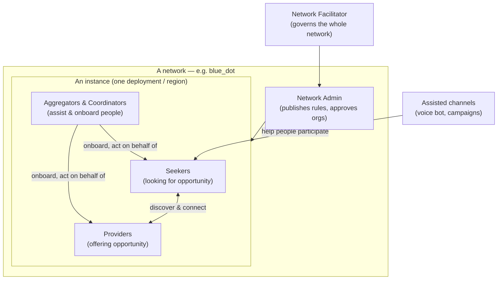
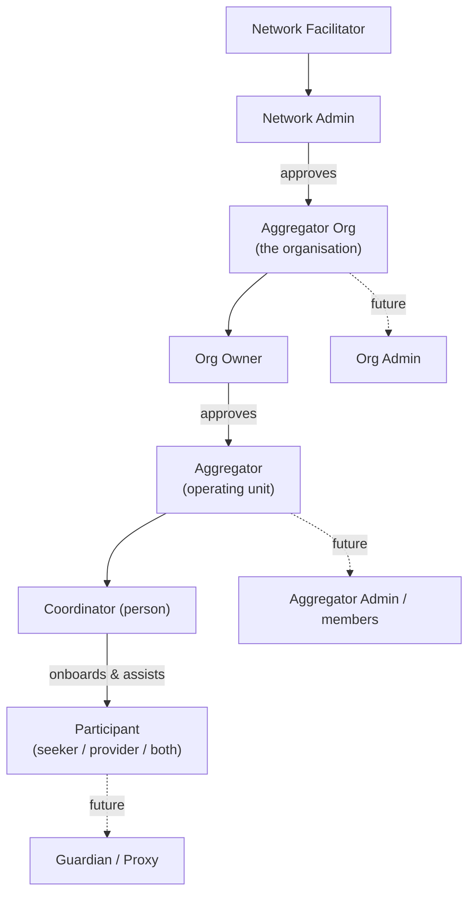
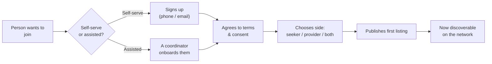
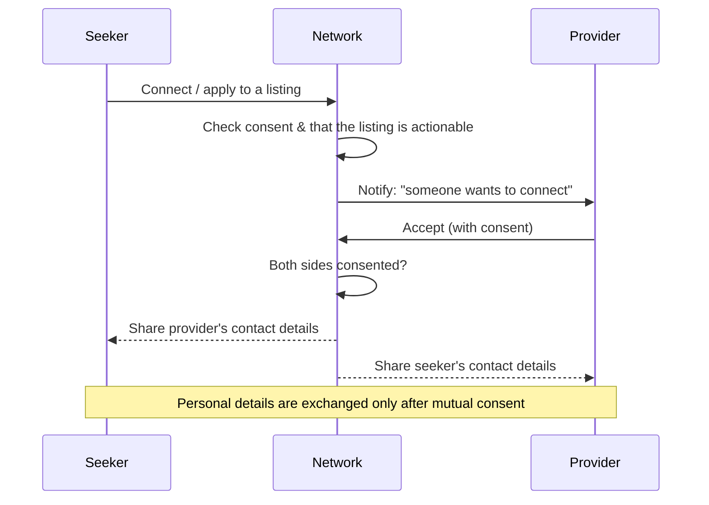
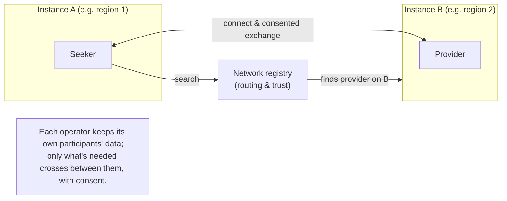
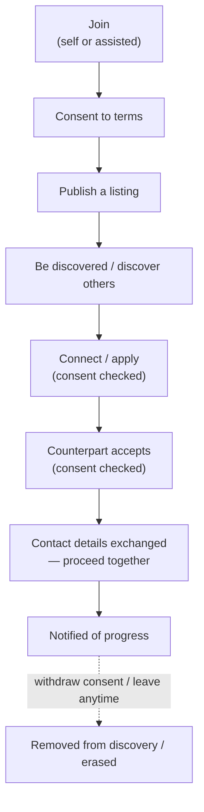

# Blue Dots Network — Functional & Business Use-Case Document

**Date:** 2026-07-17 · **Branch:** `feat/keycloak-migration` (off `feature`)
**Audience:** Product, business stakeholders, adopters and partners. **Non-technical** — no auth mechanics, schemas, or code.
**Status:** Functional baseline. This is the plain-language description of *how the network works and what it does for whom*. It is the base layer of functional requirements that the technical designs (e.g. the IAM Actor & Action Register, the multi-instance IAM design, consent designs) build on top of.

---

## 1. What this document is

Blue Dots is a **digital public network** that coordinates people and organisations around opportunity — a **seeker** side (people looking for something: work, services, support) and a **provider** side (those offering it). The network's job is to let the right parties **find each other, connect with consent, and act** — at scale, across many operators and regions, while each operator keeps ownership of their own participants' data.

This document describes the network **functionally**: the roles, the journeys, and the value exchanged. Every section uses the same lens — **Who / What / When / How / Until / Where / Why (5W+2H)** — so it reads consistently and so requirements can be traced back to a shared understanding.

> **How to read the 5W+2H (business meaning):** **Who** = the people/roles involved · **What** = what happens / value exchanged · **When** = the trigger or point in the journey · **How** = the functional steps · **Until** = how long it lasts / when it ends · **Where** = where in the network it happens · **Why** = the outcome it serves.

---

## 2. The network at a glance

**Network-level 5W+2H (the whole system in one block):**

| | |
|---|---|
| **Who** | Seekers and providers (the participants); aggregators & coordinators who assist them; network facilitators & admins who govern; assisted channels (voice, campaigns) that help people reach the network. |
| **What** | A trusted place where seekers and providers **discover each other and connect around opportunities**, with consent and governance built in. |
| **When** | Continuously — people join, list, discover, and connect over time; the network is always on. |
| **How** | Participants (directly or with an aggregator's help) publish listings; the network makes them **discoverable**; interested parties **connect/apply**; **consent gates every exchange** of personal information. |
| **Until** | Participation lasts until a participant leaves or erases their data; individual listings and interactions each have their own lifecycle. |
| **Where** | Within a network (e.g. `blue_dot`), potentially spanning **multiple instances** (regions/operators) that behave as **one** network. |
| **Why** | To coordinate access and opportunity at scale as shared public infrastructure — with **data sovereignty for operators** and **consent for participants**. |

---

## 3. Key concepts in plain language

| Term | Plain meaning |
|---|---|
| **Network** | A shared agreement about who participates and how they interact (e.g. `blue_dot`). Everyone in it plays by the same rules. |
| **Domain (side/role)** | Which side of the network someone is on: **seeker** or **provider**. A person can be **both**. |
| **Instance** | One deployment of the network — often per region or operator (e.g. a state-level deployment). Several instances can make up **one** network. |
| **Participant** | A person taking part — a seeker, a provider, or both. |
| **Listing / profile ("item")** | What a participant publishes — a profile, a job, a service offer. A participant can have **several**. |
| **Interaction ("action")** | Something one participant does towards another — **connect**, **apply**, express interest, accept. |
| **Aggregator** | An organisation that brings many participants onto the network and manages their listings **on their behalf** (e.g. an employer body, an NGO, a mission unit). |
| **Coordinator** | A **person** who does that ground work for an aggregator. Many coordinators can work under one aggregator. |
| **Network Facilitator** | Whoever runs the network as a whole — admits operators, keeps the network coherent. |
| **Network Admin** | Governs within the network — approves organisations, publishes the rules (what listings look like, what people consent to). |
| **Consent & terms** | What a participant agrees to before their information is shared or acted on. |

---

## 4. The roles (business view)

- **Participant (seeker / provider / both)** — the end user; owns their listings and interactions.
- **Aggregator (operating unit)** — the organisation-level identity that *owns and manages* the listings it brings on. **Not a person.**
- **Coordinator (person)** — does the ground work for an aggregator; **many people can operate one aggregator** (the multi-user model). May work for more than one aggregator.
- **Org Owner** (and future **Org Admin**) — governs an aggregator organisation; approves the aggregators/coordinators under it.
- **Network Admin** — approves organisations, publishes the network's rules and consent copy, handles complaints.
- **Network Facilitator** — runs the network across operators; admits instances.
- **Guardian / Proxy (future)** — acts for a participant who can't act for themselves.
- **Assisted channels** — a **voice assistant (Raya)** and **campaign outreach** help people participate without a screen; they always act **on behalf of** a real person or an authorised operator.

---

## 5. Use cases

Each use-case is one 5W+2H block, with a diagram where a flow helps.

### UC1 — Network formation & governance

| | |
|---|---|
| **Who** | Network Facilitator; Network Admin. |
| **What** | Stand up a network, admit an operator/instance, and publish the rules everyone follows (what listings look like, what participants consent to). |
| **When** | At network launch, and whenever a new operator/region joins or rules change. |
| **How** | The facilitator admits an instance into the network; the admin publishes the listing templates and consent text; the instance goes live. |
| **Until** | Rules stay in force until republished; an instance participates until it leaves the network. |
| **Where** | At the network level (governance), applied within each instance. |
| **Why** | So every participant and operator interoperates under one trusted, consistent contract. |

### UC2 — A participant joins

| | |
|---|---|
| **Who** | A prospective participant; optionally a Coordinator who assists. |
| **What** | Become a recognised participant on the network as a seeker, provider, or both. |
| **When** | Whenever someone wants to take part — directly, or when an aggregator brings them on. |
| **How** | Sign up (self-serve) or be onboarded by a coordinator; agree to terms/consent; choose the side; publish a first listing. Some assisted participants may never log in themselves — a coordinator acts for them. |
| **Until** | The account persists until the participant leaves or erases their data. |
| **Where** | On one instance (their home); their listing becomes discoverable network-wide. |
| **Why** | To let people access opportunity whether or not they are digitally self-sufficient. |

### UC3 — Aggregator & coordinator onboarding

| | |
|---|---|
| **Who** | Org Owner; Network Admin (approves the org); Coordinators. |
| **What** | An organisation joins to bring many participants onto the network and manage their listings on their behalf. |
| **When** | When an employer body, NGO, or mission unit wants to operate on the network at scale. |
| **How** | The org owner registers → the network admin approves the org → the owner sets up aggregator units and approves coordinators → **several coordinators can operate under one aggregator** (multi-user). Each aggregator is a seeker-side or provider-side operator. |
| **Until** | The org and its aggregators operate until offboarded; if a coordinator leaves, their participants are **reassigned, never orphaned**. |
| **Where** | Within an instance; the aggregator owns the listings it brings on. |
| **Why** | To onboard and support large cohorts of participants who need assistance. |

### UC4 — Creating a profile / listing

| | |
|---|---|
| **Who** | A participant, or a coordinator acting on their behalf. |
| **What** | Publish a structured listing — a profile, a job, a service offer — following the network's template. |
| **When** | At join, and whenever the participant has something new to offer or seek. |
| **How** | Fill in the network's listing template; the listing is owned by the participant (or, when assisted, managed by the aggregator that onboarded it). A participant can hold **several listings**, and different listings can be managed by different aggregators. |
| **Until** | A listing stays live until withdrawn, fulfilled, or paused. |
| **Where** | Created at the home instance; discoverable network-wide. |
| **Why** | Listings are the unit of discovery — they are what others find and act on. |

### UC5 — Discovery

| | |
|---|---|
| **Who** | Any participant (typically a seeker looking for providers, or vice-versa). |
| **What** | Find relevant counterparts across the network. |
| **When** | Whenever a participant is looking. |
| **How** | Search/browse; the network returns **only listings that are discoverable and consented**, showing **non-personal** details (skills, role, location) — never contact details — until a connection is made. |
| **Until** | Results reflect the live state at query time. |
| **Where** | Across the whole network, including other instances, presented as one set of results. |
| **Why** | So the right parties can find each other without exposing personal information prematurely. |

### UC6 — Connect / apply (the core interaction)

| | |
|---|---|
| **Who** | An initiating participant and a receiving participant. |
| **What** | Express interest and, on mutual acceptance, exchange the contact details needed to proceed. |
| **When** | After discovery, when a participant wants to act on a listing. |
| **How** | Initiate a connect/apply (**consent checked at this point**); the other party is notified and can accept (**consent checked again**); **only on mutual acceptance** are personal contact details exchanged. |
| **Until** | The interaction persists as a record; the personal-data exchange is bounded by what was consented. |
| **Where** | Between two participants, who may be on **different instances** (see UC10). |
| **Why** | This is the network's core value — turning discovery into a real, consented connection. |

### UC7 — Consent & terms

| | |
|---|---|
| **Who** | Every participant (and, for assisted users, a guardian/proxy in future). |
| **What** | Agree to what happens with their information and their participation. |
| **When** | At sign-up/login, when creating a listing, when **initiating** an interaction, and when **accepting** one. |
| **How** | Clear consent prompts at each of those moments; a participant who hasn't consented is **hidden from discovery and cannot be acted on** — not merely blocked from their own actions. Consent can be withdrawn. |
| **Until** | Consent stands until withdrawn; withdrawal removes the participant from discovery and interaction. |
| **Where** | Recorded at the participant's home instance; honoured network-wide. |
| **Why** | Trust and lawful data handling — the network only shares and acts where the participant has agreed. |

### UC8 — Matching / compatibility

| | |
|---|---|
| **Who** | Participants (seekers and providers); the network's matching capability. |
| **What** | Surface the *most relevant* counterparts, not just any match — ranked by fit. |
| **When** | During discovery and outreach. |
| **How** | The network assesses compatibility between listings (e.g. a seeker's needs vs a provider's offer) and orders results by relevance, over the consented, discoverable set. |
| **Until** | Reflects the current state of listings and preferences. |
| **Where** | Across the network's discoverable listings. |
| **Why** | To make discovery useful at scale — good matches, less noise. |

### UC9 — Notifications

| | |
|---|---|
| **Who** | Any participant or operator awaiting an event. |
| **What** | Be told when something relevant happens — a connect request, an acceptance, a status change. |
| **When** | On the events that matter to each role. |
| **How** | Messages over the participant's channel (SMS, email, and similar), triggered by network events. |
| **Until** | Per message; preferences may govern what is sent. |
| **Where** | To the participant, wherever they are. |
| **Why** | Interactions only progress if people know to respond. |

### UC10 — Working across instances (the network behaves as one)

| | |
|---|---|
| **Who** | Participants on different instances; the network registry that ties instances together. |
| **What** | Discover and connect with counterparts on **other** instances as if it were one network. |
| **When** | Whenever the best match lives on another operator's deployment. |
| **How** | A shared registry lets instances **find and trust each other**; discovery spans instances (non-personal details only); on a consented connection, the needed personal details pass **directly between the two operators**, never pooled centrally. |
| **Until** | The connection and any consented exchange persist per their own lifecycle. |
| **Where** | Across instances of the same network. |
| **Why** | Opportunity isn't confined to one region/operator — and **operators keep sovereignty over their own data**. |

### UC11 — Campaigns & assisted outreach

| | |
|---|---|
| **Who** | An operator (network admin / org owner / coordinator) running outreach; assisted channels (voice bot, campaign tool); the participants they reach. |
| **What** | Proactively reach cohorts of participants — e.g. tell relevant seekers about opportunities, or help them apply by voice. |
| **When** | Around drives, mission pushes, or opportunity launches. |
| **How** | An operator selects a cohort they are allowed to see; outreach goes out (voice call, message); assisted channels always act **on behalf of** a real person or an authorised operator — never anonymously. Personal data is only used for the purpose consented and is **logged**. |
| **Until** | For the duration of the campaign; consent and purpose bound what can be used. |
| **Where** | Within the operator's own participants; expanding to a network capability as it matures. |
| **Why** | To reach people who need assistance and drive real participation, especially those who can't self-serve. |

---

## 6. A participant's end-to-end journey

The through-line: **discovery is open but non-personal; personal information moves only with consent, at the moment of a real connection; and the participant stays in control throughout.**

---

## 7. How this feeds the technical designs

This functional baseline is the *what* and *why*. The *how it's built* is specified in the technical designs, which trace back to these use-cases:

- **IAM & Auth Actor & Action Register** (`2026-07-17-iam-actor-action-register.md`) — the technical identities, permissions, and modeling behind every role and interaction here.
- **Multi-instance IAM design** (`2026-07-08-multi-instance-iam-design.technical.md`) — how UC10 (across instances) works under the hood.
- **Consent designs** — the mechanics behind UC7, gating UC5/UC6 discovery and connect.
- **Keycloak migration design** — the login and identity foundation for UC2/UC3.

Where a future capability is named here (guardian/proxy, org-admin tier, network-wide campaigns, cross-instance action), it is a **functional intent** to be scheduled — not yet built.
