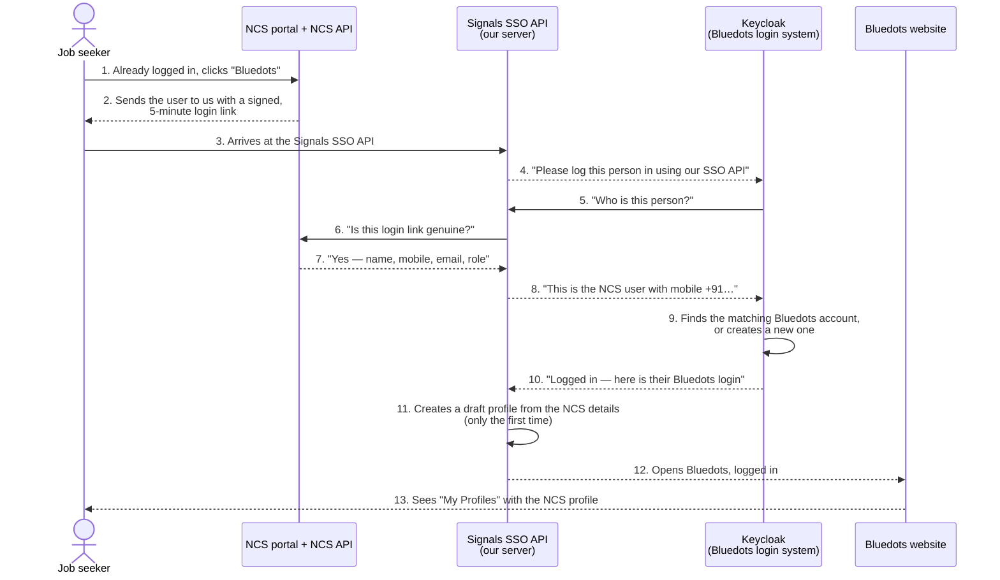
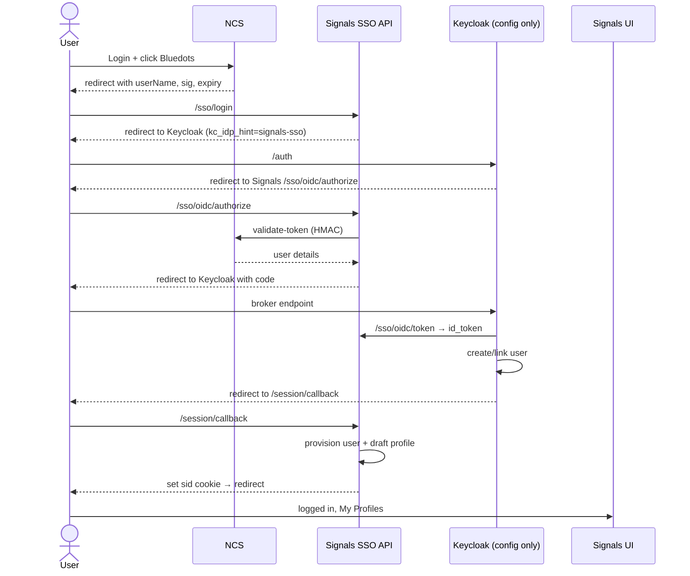
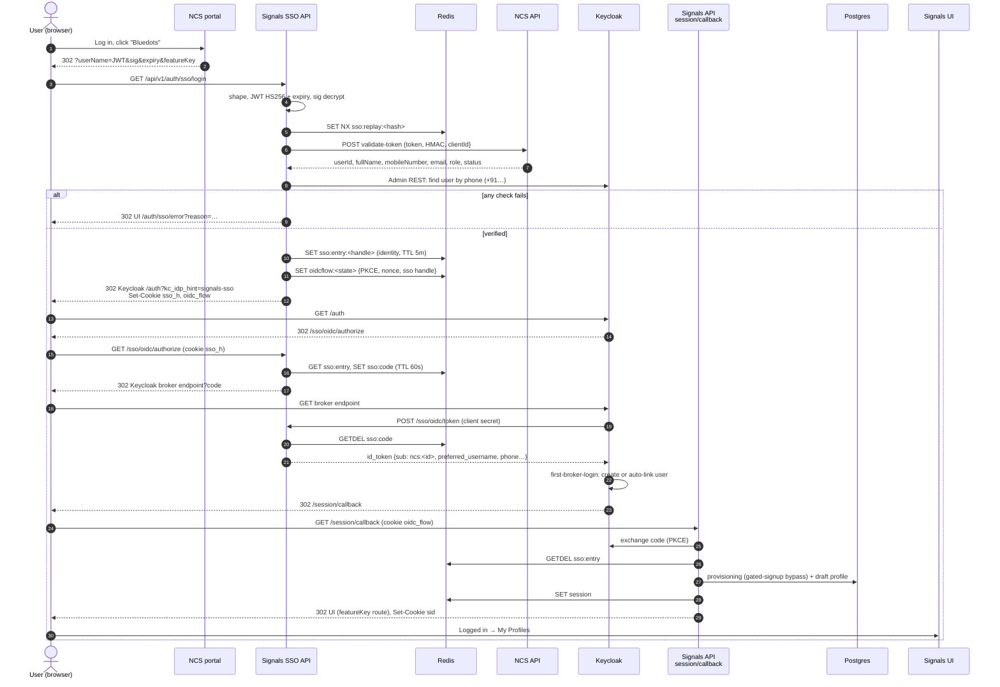

# External Identity-Provider Bridge (first provider: NCS SSO) — Design

**Date:** 2026-09-24
**Status:** Draft — open questions in §11 must be answered before implementation
**Auth provider:** Keycloak only (`AUTH_PROVIDER=keycloak`); better-auth is not involved

## 0. In plain terms (for readers new to Signals)

**What Bluedots / Signals is.** Bluedots is a platform where job seekers,
employers and training providers create profiles and find each other.
"Signals" is the software behind it: a website (the **Signals UI**) and a
server (the **Signals API**) that stores users and profiles.

**What NCS is.** The National Career Service portal (run by the Government of
India) already has millions of registered job seekers who log in there.

**What we want.** A job seeker who is already logged in to NCS clicks a
"Bluedots" link and arrives in Bluedots **already logged in**, with a profile
pre-filled from their NCS details — no second sign-up, no OTP, no password.

**The pieces involved.**

| Piece | What it is, in one line |
|---|---|
| **NCS portal** | The government site where the user is already logged in. We cannot change it. |
| **NCS API** | A service NCS runs that tells a partner "yes, this login link is genuine, and here are the user's details". |
| **Signals API** | Our server. We add a new **Signals SSO API** to it for this feature. |
| **Keycloak** | The login system Bluedots already uses. It is the only thing allowed to issue a Bluedots login. We only change its settings, once. |
| **Signals UI** | The Bluedots website the user ends up on. |

**Why the detour through Keycloak?** Bluedots only trusts logins that Keycloak
issues. NCS does not speak Keycloak's language, so the Signals SSO API acts as
a translator: it checks the NCS link, then vouches for the user to Keycloak in
the standard format Keycloak understands (the same way "Log in with Google"
works). Keycloak then issues a normal Bluedots login.



**What the user actually sees:** they click the link on NCS, the browser
blinks through a few redirects in under a second, and they are inside
Bluedots. Steps 3–12 are invisible.

**How accounts are matched.** NCS always sends the user's mobile number. If a
Bluedots account already has that number (and NCS says the number is
verified), the user gets that existing account. Otherwise a new account is
created. We never match on email, because NCS does not guarantee emails are
verified.

**What happens if something is wrong** (link expired or already used, NCS says
the link is fake, NCS is down, account inactive): the user sees a Bluedots
error page with a "Back to NCS" button. They are never shown an OTP screen and
never logged in to the wrong account.

**What is new vs. what already exists.**

- New: the Signals SSO API (steps 3, 5–8, 11), a small change to who may sign
  up, a "complete your profile" draft, and an error page.
- Already exists, unchanged: Keycloak itself, Bluedots login sessions, profiles,
  consent before a profile goes public.
- One-time setting in Keycloak: register the Signals SSO API as a trusted login
  source.

## 1. Problem

The National Career Service (NCS) portal will host a link to Bluedots. A user
who is already logged in to NCS must land in Bluedots **already logged in** —
no OTP, no login screen — and see a profile under "My Profiles" built from
their NCS details.

Constraints:

- **NCS will make no code changes.** We consume their existing partner
  contract (§3) as-is. NCS only registers our redirect URL and issues a
  Client ID + Client Secret.
- **Keycloak is the only identity provider.** Every browser session holds real
  Keycloak access/refresh tokens and every request re-verifies the access token
  (`plugins/auth/resolve_browser_session.ts`). Signals cannot mint a session on
  its own — Keycloak must issue the tokens.
- **Keycloak changes must be one-time.** Adding a future partner portal should
  need Signals code/config only, not realm changes.

NCS is not an OIDC provider and publishes no JWKS, so Keycloak's native
identity brokering cannot consume it directly.

## 2. Decision

Build a **generic external-identity bridge inside the Signals API** that looks
like a standard OIDC provider to Keycloak. Register it in the realm **once** as
identity provider `signals-sso`. Each partner portal is a small adapter in
Signals; NCS is the first.

Rejected alternatives:

| Option | Why rejected |
|---|---|
| Keycloak brokering NCS directly | NCS has no OIDC / JWKS and will not add one |
| External→internal token exchange | Needs NCS JWKS; preview feature |
| Impersonation token exchange | Preview feature; lets the API mint a session for any user |
| Custom Keycloak Java authenticator | Works, but Java/SPI outside team stack, per-provider realm work, upgrade fragility |
| Signals-only session without Keycloak tokens | Second identity system; bypasses realm roles/logout; violates Keycloak-only |

## 3. NCS contract (as observed)

### 3.1 Entry link

NCS redirects the browser to our registered URL:

```
GET <redirect-url>?userName=<JWT>&sig=<CryptoJS-AES>&expiry=<epoch.ms>&featureKey=<key>
```

| Param | Format | Meaning |
|---|---|---|
| `userName` | JWT, `HS256`, signed with the **Client Secret**. Payload `{ userName, iat, exp }`, lifetime **5 min** | Identity assertion. `userName` observed as `dge-mole_<email>` |
| `sig` | CryptoJS AES passphrase format (`Salted__` + 8-byte salt + AES-256-CBC ciphertext, EVP_BytesToKey/MD5 KDF), passphrase = **Client Secret** | Tamper check over the link — plaintext contents TBD (§11) |
| `expiry` | epoch seconds with ms fraction | Same instant as the JWT `exp` |
| `featureKey` | string, e.g. `placement-prep` | Deep-link target |

### 3.2 User details — `POST {NCS_BASE_URL}/api/integration/validate-token`

The `userName` JWT is the token for this API; it returns full user details.

```json
{ "token": "<userName JWT>", "hmac": "<hex HMAC-SHA256(ClientSecret, token)>", "clientId": "<ours>" }
```

Success `data`: `userId, fullName, mobileNumber (10-digit), role, email,
isEmailVerified, isMobileVerified, isDigilockerVerified, isProfileComplete, status`.
Failure: `status: "FAILURE"`, `statusCode: 401`.

**`mobileNumber` is mandatory on the NCS side and always returned** (confirmed
with NCS). The adapter treats a response without a well-formed 10-digit
`mobileNumber` as a verification failure (fail closed) rather than a user with
no phone.

Base URLs: staging `https://ncsapi.centralindia.cloudapp.azure.com`, prod
`https://betacloud.ncs.gov.in`.

## 4. Flow

The link is **fully verified at arrival** (step 3), before anything is written
or Keycloak is involved. A bad, expired or replayed link fails in
microseconds and never reaches NCS or Keycloak.

```
 1. User logs in on NCS, clicks the Bluedots link.
 2. NCS → browser → GET /api/v1/auth/sso/login?userName&sig&expiry&featureKey
    (no partner name in the URL — the provider comes from SSO_PROVIDERS)
 3. API (/sso/login) — provider.verify(), cheapest checks first:
        a. shape + length limits
        b. userName JWT HS256 with Client Secret; exp not passed, iat not future
        c. sig decrypts with Client Secret and matches; expiry == JWT exp
        d. replay guard: SET NX sso:replay:<provider>:<sha256(JWT)> until exp
        e. POST NCS validate-token (HMAC over the JWT) → SUCCESS, status ACTIVE,
           mobileNumber present
        f. account-linking decision (§6) → preferred_username
    Any failure → 302 UI /auth/sso/error?reason=<code>
 4.   SET sso:entry:<sha256(handle)> = verified identity + claims (TTL 5 min)
 5.   start the normal login flow (state, PKCE, nonce; flow state carries the
      handle); clear any existing sid; set httpOnly cookies sso_h + oidc_flow
      → 302 Keycloak /auth?client_id=signals-ui&kc_idp_hint=signals-sso
 6. Keycloak → 302 /api/v1/auth/sso/oidc/authorize?client_id&redirect_uri&state&nonce
 7. /sso/oidc/authorize: client_id + exact redirect_uri check; read sso_h cookie;
      GET sso:entry:<hash>; SET sso:code:<sha256(code)> → handle + nonce (TTL 60s)
      → 302 Keycloak broker endpoint?code&state
 8. Keycloak → POST /api/v1/auth/sso/oidc/token (server-to-server, client secret)
      GETDEL sso:code → id_token signed with SSO_OIDC_SIGNING_KEY (claims §5)
    Keycloak verifies it via /api/v1/auth/sso/oidc/jwks (cached)
 9. Keycloak first-broker-login (§7): create or auto-link user → issue tokens
10. Keycloak → 302 /api/v1/auth/session/callback (existing)
11. Callback: exchange code; flow state has an SSO handle →
      GETDEL sso:entry:<hash>; provisioning with the gated-signup bypass (§8);
      profile bootstrap (§9); create Redis session; set sid cookie
12. 302 UI route resolved from featureKey → user is logged in, sees My Profiles
```

Per login: 5 browser redirects; server calls = NCS validate-token ×1,
Keycloak Admin find-by-phone ×1, Keycloak→/sso/oidc/token ×1, existing code
exchange ×1 (JWKS cached); ~8 Redis ops.

The user sees none of steps 3–11.

### 4.1 Overview



### 4.2 Detailed



## 5. SSO id_token claims

| Claim | Value |
|---|---|
| `iss` | `<api-base>/api/v1/auth/sso/oidc` |
| `aud` | the Keycloak broker client id |
| `sub` | `ncs:<data.userId>` — namespaced per provider, never collides across partners |
| `sso_provider` | `ncs` |
| `preferred_username` | existing Keycloak username if linked (§6), else `+91<mobileNumber>` |
| `name` | `data.fullName` |
| `phone_number` / `phone_number_verified` | `+91<mobileNumber>` / `isMobileVerified` |
| `ext_email` / `ext_email_verified` | `data.email` / `isEmailVerified` — **not** the standard `email` claim (§6) |
| `ext_role` | `data.role` (e.g. `JOBSEEKER`) |
| `nonce` | echoed from Keycloak's authorize request |

Lifetime 60s. Signed with `SSO_OIDC_SIGNING_KEY` (RS256/ES256);
public key served at `/jwks`.

## 6. Account linking — the SSO API decides, Keycloak executes

Realm facts (`infra/keycloak/realms/bluedots-realm.json`,
`services/auth/user_to_keycloak.ts`): usernames are **email-first, then phone**;
`duplicateEmailsAllowed` is false.

Mobile is always present (§3.2), so **phone is the linking key**. Normalise
once: strip spaces, require exactly 10 digits, prefix `+91` — the same form
`user.phone_number` and the Keycloak `phoneNumber` attribute already hold.

Rules, evaluated by the bridge in order:

1. **Returning NCS user** — Keycloak already holds the federated link for
   `sub=ncs:<userId>`; first-broker-login does not run.
2. **Existing Bluedots user, first NCS login** — a local `user` has
   `phone_number = +91<mobile>`:
   - `isMobileVerified = true` → the bridge emits that user's Keycloak username
     as `preferred_username`; first-broker-login auto-links on username.
   - `isMobileVerified = false` → **refuse** (`SSO_PHONE_UNVERIFIED`).
     Auto-linking on an unverified number would hand an existing account to
     whoever typed that number into NCS.
   Because the bridge alone sets `preferred_username`, and never derives it
   from NCS-supplied email, this is phone-based linking without a Java
   authenticator.
3. **Never link on email.** NCS emails are not reliably verified
   (`isEmailVerified: false` in their own example). The NCS email is sent as
   `ext_email`, not `email`, so Keycloak's email matching and duplicate-email
   check never fire on it.
4. **New user** (no local user with that phone) — `preferred_username =
   +91<mobile>`, matching the realm's existing email-then-phone username
   convention (`keycloakUsername` in `user_to_keycloak.ts`); the Keycloak
   `phoneNumber` attribute and local `user.phone_number` are set from it, with
   `phoneNumberVerified = isMobileVerified`. No email on the Keycloak user; the
   NCS email is kept as an attribute for profile prefill only. Side benefit: if
   direct OTP login is enabled on the instance, the same user can later sign in
   by phone OTP and land on the same account.
5. **Conflict** — the phone matches a Keycloak user already linked to a
   *different* `ncs:` subject (NCS reassigned a number, or two NCS accounts share
   one). Keycloak itself refuses a second link to the same identity provider,
   so no extra lookup is made; the failure is logged as `SSO_LINK_CONFLICT`.
6. **Phone changed on NCS** — a returning `ncs:<userId>` arrives with a
   different mobile: do **not** rewrite the Bluedots phone automatically
   (`syncMode=IMPORT` keeps the first value); log for review.

## 7. Keycloak realm (one-time)

Shipped in `infra/keycloak/realms/bluedots-realm.json` and, for realms that
already exist, `infra/keycloak/init/apply-sso-idp.sh` (idempotent):

- Identity provider `signals-sso` (OIDC): issuer + authorize URL on the public
  API base, token + JWKS URLs on the internal base; `client_secret_post`;
  `trustEmail=false`; `syncMode=IMPORT`; `disableUserInfo=true`; hidden on the
  login page.
- Mappers: `oidc-username-idp-mapper` (`${CLAIM.preferred_username}`),
  `oidc-user-attribute-idp-mapper` for `phoneNumber`, `phoneNumberVerified`,
  `sso_provider`, and `oidc-hardcoded-role-idp-mapper` → `signals_participant`
  (required by `KEYCLOAK_REQUIRED_REALM_ROLES`).
- First-broker-login flow `signals-sso-first-login`: *Create User If Unique*
  and *Automatically Set Existing User*, both ALTERNATIVE — Keycloak's
  documented auto-link shape. **No** *Detect Existing Broker User* step: it
  returns `attempted` once create-if-unique has recorded the existing account,
  which fails a REQUIRED step (found in local testing).
- `identity-provider-redirector` is the **first** step of `bluedots-otp-browser`,
  before `auth-cookie`, so a leftover SSO session in the browser can never log
  in its previous owner instead of the partner user.

## 8. Signals API changes

| File | Change |
|---|---|
| `routes/v1/auth/sso/sso_routes.ts` (new) | registers the SSO routes under `/api/v1/auth/sso` |
| `routes/v1/auth/sso/sso_login.ts` (new) | `GET /api/v1/auth/sso/login`: verify, stash, start login flow |
| `routes/v1/auth/sso/oidc_routes.ts` (new) | `.well-known/openid-configuration`, `authorize`, `token`, `jwks` under `/api/v1/auth/sso/oidc` |
| `services/auth/sso/types.ts` (new) | `SsoProvider`, `SsoIdentity`, `SsoFailure` |
| `services/auth/sso/registry.ts` (new) | active provider from `SSO_PROVIDERS` |
| `services/auth/sso/providers/ncs.ts` (new) | NCS link verification (§4 step 3) |
| `services/auth/sso/ncs_client.ts` (new) | `validate-token` call: HMAC, timeout, fail closed |
| `services/auth/sso/sso_crypto.ts` (new) | HMAC hex, CryptoJS-format AES decrypt, phone normalisation |
| `services/auth/sso/sso_store.ts` (new) | Redis: replay guard, entry stash, one-time codes |
| `services/auth/sso/oidc_keys.ts` (new) | id_token signing + JWKS |
| `services/auth/sso/link_resolver.ts` (new) | §6 decision via Keycloak Admin `findByPhone` |
| `services/auth/sso/sso_profile_bootstrap.ts` (new) | §9 |
| `services/auth/oidc_flow_state.ts` | flow state carries an optional `sso` handle |
| `services/auth/oidc_exchange.ts` | `buildAuthorizeUrl` accepts `idpHint` + `prompt` |
| `routes/v1/auth/session.ts` | login-flow start extracted to a shared helper; callback runs §8/§9 when the flow has an SSO handle |
| `services/auth/provisioning.ts` | `allowSignup` option (used only by the SSO callback path) |

Env (`packages/config/src/secrets.ts` **and** `turbo.json` `SSO_*`):
`SSO_PROVIDERS`, `SSO_OIDC_SIGNING_KEY`, `SSO_OIDC_CLIENT_ID`,
`SSO_OIDC_CLIENT_SECRET`, `SSO_NCS_BASE_URL`, `SSO_NCS_CLIENT_ID`,
`SSO_NCS_CLIENT_SECRET`, `SSO_NCS_TIMEOUT_MS`, `SSO_NCS_MAPPING`.
Startup guard: a listed provider with missing secrets, or SSO enabled without
`AUTH_PROVIDER=keycloak`, fails boot.

## 9. Profile bootstrap

Runs after provisioning on every external login; idempotent.

- If the user has **no** profile in the target domain → create a **draft**
  profile through the normal item-creation service (so `item_instance_url`,
  PII encryption, profile cap and single-domain lock all apply).
- If a profile exists → do nothing. Never overwrite user edits.
- Failure is logged, never blocks login.
- Mapping lives in `SSO_NCS_MAPPING` (JSON), per instance:

```json
{
  "network": "blue_dot",
  "item_type": "profile_1.0",
  "role_to_domain": { "JOBSEEKER": "<seeker-domain>" },
  "fields": { "fullName": "<name-field>", "mobileNumber": "<phone-field>", "email": "<email-field>" },
  "feature_routes": { "placement-prep": "/" },
  "app_origin": "https://<ui-host>"
}
```

- The user's domain is claimed through the existing default-aggregator
  mechanism (`tagUserForDomain`) rather than a dedicated NCS org.

  Fields the schema does not declare are dropped. Unmapped roles → no profile.
- Profile stays `draft` until the user completes required fields and consents
  (`go_live_required`). NCS supplies no DOB, so the U18 path is still decided
  in-app before go-live.

## 10. Security

`/api/v1/auth/sso/login` must be public (the browser arrives straight from
NCS), so protection is verification of the link plus limiting abuse.

| Threat | Protection |
|---|---|
| Forged link | JWT HS256 with Client Secret + `sig` + NCS `validate-token` |
| Stolen / copied link | 5-min lifetime, `iat` not in the future (30 s skew), single use (`SET NX` on the JWT hash) |
| Flooding us or NCS | cheapest checks first (length → JWT → sig) before any Redis write or NCS call; `public_rate_limit` per IP; concurrency cap + short circuit-breaker on NCS |
| Token leaking | never logged; ingress logs this path without query string; `Referrer-Policy: no-referrer`, `Cache-Control: no-store`; token never forwarded — only an opaque handle in an httpOnly `Secure` `SameSite=Lax` cookie |
| Open redirect | `featureKey` → allowlisted route map; app origin from config; `/sso/oidc/authorize` requires exact `redirect_uri` (else 400, no redirect) |
| Wrong account | existing `sid` and its Keycloak session ended server-side; redirector before `auth-cookie`; callback refuses a session whose `preferred_username` differs from the one the SSO API vouched for; link only on verified phone; never on email |
| Forged id_tokens | `/sso/oidc/token` reachable only by Keycloak (internal URL, blocked at ingress), client secret compared in constant time, one-time 60 s codes bound to `redirect_uri`; signing key in the secret store with `kid` rotation |

Fail closed everywhere: NCS down / timeout / FAILURE / `status != ACTIVE` →
error page with "Back to NCS"; never an OTP or login-form fallback.
`SSO_PROVIDERS` empty → every SSO route answers 404.

## 11. Open questions (NCS)

1. `sig` plaintext — what exactly is encrypted (userName? userName+expiry?) so we
   know what to compare.
2. HMAC for `validate-token` with this token — confirm data = the JWT string
   only, hex lowercase.
3. Is `userName` stable and unique per user? Is `data.userId` always returned?
   Is `isMobileVerified` always `true` (i.e. NCS OTP-verifies the mandatory
   mobile at signup)? If yes, the refusal branch in §6 rule 2 is a safety net
   only.
4. Full list of `featureKey` values and intended landing pages.
5. Separate Client ID / redirect URL per Signals instance (up-gzb, ka-dhwd), or
   one entry that routes by state?
6. Roles other than `JOBSEEKER` that may arrive (employer/provider)?
7. Logout coupling — independent sessions assumed.

## 12. Out of scope

- Pushing assessments / training results back to NCS
  (`/api/partner-data/*`) — phase 2.
- Updating an existing profile from later NCS logins.
- Any partner other than NCS (the bridge supports it; no adapter yet).

## 13. Testing

- Unit: JWT verify (valid / expired / bad signature), CryptoJS decrypt
  (fixture generated with the CryptoJS format), HMAC vector, replay guard,
  linking rules §6 (each branch, incl. unverified-phone refusal and phone
  change), phone normalisation (spaces, `+91`/`0` prefixes, non-10-digit →
  reject), missing `mobileNumber` → fail closed, featureKey allowlist,
  bootstrap idempotency.
- Bridge endpoints: code single-use, wrong client secret, nonce echo, JWKS.
- Integration: full flow against a local Keycloak with the realm import and an
  NCS stub (`validate-token` fixture) — first login, returning login,
  existing-phone link, conflict, NCS-down.
