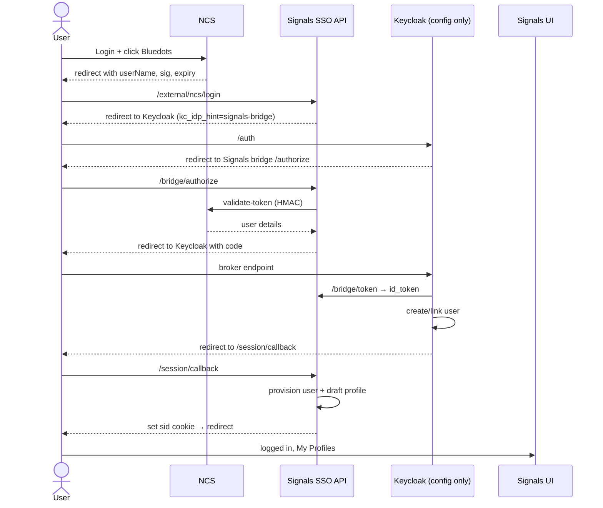
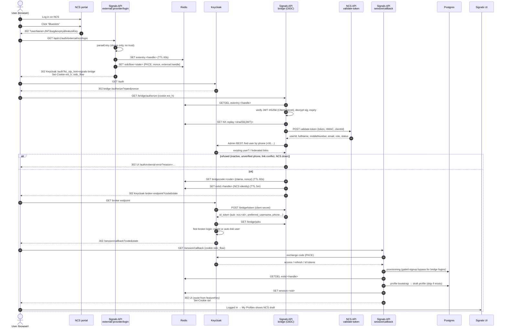

# External Identity-Provider Bridge (first provider: NCS SSO) — Design

**Date:** 2026-09-24
**Status:** Draft — open questions in §11 must be answered before implementation
**Auth provider:** Keycloak only (`AUTH_PROVIDER=keycloak`); better-auth is not involved

## 1. Problem

The National Career Service (NCS) portal will host a link to Bluedots. A user
who is already logged in to NCS must land in Bluedots **already logged in** —
no OTP, no login screen — and see a profile under "My Profiles" built from
their NCS details.

Constraints:

- **NCS will make no code changes.** We consume their existing partner
  contract (§3) as-is. NCS only registers our redirect URL and issues a
  Client ID + Client Secret.
- **Keycloak is the only identity provider.** Every browser session holds real
  Keycloak access/refresh tokens and every request re-verifies the access token
  (`plugins/auth/resolve_browser_session.ts`). Signals cannot mint a session on
  its own — Keycloak must issue the tokens.
- **Keycloak changes must be one-time.** Adding a future partner portal should
  need Signals code/config only, not realm changes.

NCS is not an OIDC provider and publishes no JWKS, so Keycloak's native
identity brokering cannot consume it directly.

## 2. Decision

Build a **generic external-identity bridge inside the Signals API** that looks
like a standard OIDC provider to Keycloak. Register it in the realm **once** as
identity provider `signals-bridge`. Each partner portal is a small adapter in
Signals; NCS is the first.

Rejected alternatives:

| Option | Why rejected |
|---|---|
| Keycloak brokering NCS directly | NCS has no OIDC / JWKS and will not add one |
| External→internal token exchange | Needs NCS JWKS; preview feature |
| Impersonation token exchange | Preview feature; lets the API mint a session for any user |
| Custom Keycloak Java authenticator | Works, but Java/SPI outside team stack, per-provider realm work, upgrade fragility |
| Signals-only session without Keycloak tokens | Second identity system; bypasses realm roles/logout; violates Keycloak-only |

## 3. NCS contract (as observed)

### 3.1 Entry link

NCS redirects the browser to our registered URL:

```
GET <redirect-url>?userName=<JWT>&sig=<CryptoJS-AES>&expiry=<epoch.ms>&featureKey=<key>
```

| Param | Format | Meaning |
|---|---|---|
| `userName` | JWT, `HS256`, signed with the **Client Secret**. Payload `{ userName, iat, exp }`, lifetime **5 min** | Identity assertion. `userName` observed as `dge-mole_<email>` |
| `sig` | CryptoJS AES passphrase format (`Salted__` + 8-byte salt + AES-256-CBC ciphertext, EVP_BytesToKey/MD5 KDF), passphrase = **Client Secret** | Tamper check over the link — plaintext contents TBD (§11) |
| `expiry` | epoch seconds with ms fraction | Same instant as the JWT `exp` |
| `featureKey` | string, e.g. `placement-prep` | Deep-link target |

### 3.2 User details — `POST {NCS_BASE_URL}/api/integration/validate-token`

The `userName` JWT is the token for this API; it returns full user details.

```json
{ "token": "<userName JWT>", "hmac": "<hex HMAC-SHA256(ClientSecret, token)>", "clientId": "<ours>" }
```

Success `data`: `userId, fullName, mobileNumber (10-digit), role, email,
isEmailVerified, isMobileVerified, isDigilockerVerified, isProfileComplete, status`.
Failure: `status: "FAILURE"`, `statusCode: 401`.

**`mobileNumber` is mandatory on the NCS side and always returned** (confirmed
with NCS). The adapter treats a response without a well-formed 10-digit
`mobileNumber` as a verification failure (fail closed) rather than a user with
no phone.

Base URLs: staging `https://ncsapi.centralindia.cloudapp.azure.com`, prod
`https://betacloud.ncs.gov.in`.

## 4. Flow

```
 1. User logs in on NCS, clicks the Bluedots link.
 2. NCS → browser → GET /api/v1/auth/external/ncs/login?userName&sig&expiry&featureKey
 3. API (entry):  adapter.parseEntry() — shape checks only, no trust yet
 4.   stash the raw params in Redis under a random one-time handle (TTL 60s)
 5.   set httpOnly cookies: ext_h=<handle>, oidc_flow (same as /session/login)
      → 302 Keycloak /auth?client_id=signals-ui&kc_idp_hint=signals-bridge&state&PKCE
 6. Keycloak → 302 /api/v1/auth/bridge/authorize?state=<kc-state>&…
 7. Bridge: read ext_h → GETDEL the handle (single use)
 8.   adapter.verify():
        a. verify userName JWT HS256 with Client Secret; reject if exp passed
        b. decrypt sig with Client Secret; check it matches (§11)
        c. expiry == JWT exp
        d. replay guard: SET NX sha256(JWT) until exp
        e. POST validate-token (HMAC over the JWT) → require SUCCESS, status ACTIVE
      → ExternalIdentity
 9.   linking decision (§6) → issue one-time code → 302 Keycloak broker endpoint
10. Keycloak → POST /api/v1/auth/bridge/token (server-to-server, client secret)
      ← id_token signed by the bridge key (claims §5)
    Keycloak verifies via /api/v1/auth/bridge/jwks
11. Keycloak first-broker-login (§7): create or auto-link user → issue tokens
12. Keycloak → 302 /api/v1/auth/session/callback (existing)
13. API: exchange code, provisioning.ts mirrors user (§8), profile bootstrap (§9),
    create Redis session, set sid cookie
14. 302 UI route resolved from featureKey → user is logged in, sees My Profiles
```

The user sees none of steps 3–13.

### 4.1 Overview



### 4.2 Detailed



## 5. Bridge id_token claims

| Claim | Value |
|---|---|
| `iss` | `<api-base>/api/v1/auth/bridge` |
| `aud` | the Keycloak broker client id |
| `sub` | `ncs:<data.userId>` — namespaced per provider, never collides across partners |
| `ext_provider` | `ncs` |
| `preferred_username` | existing Keycloak username if linked (§6), else `+91<mobileNumber>` |
| `name` | `data.fullName` |
| `phone_number` / `phone_number_verified` | `+91<mobileNumber>` / `isMobileVerified` |
| `ext_email` / `ext_email_verified` | `data.email` / `isEmailVerified` — **not** the standard `email` claim (§6) |
| `ext_role` | `data.role` (e.g. `JOBSEEKER`) |
| `nonce` | echoed from Keycloak's authorize request |

Lifetime 60s. Signed with `EXTERNAL_IDP_BRIDGE_SIGNING_KEY` (RS256/ES256);
public key served at `/jwks`.

## 6. Account linking — the bridge decides, Keycloak executes

Realm facts (`infra/keycloak/realms/bluedots-realm.json`,
`services/auth/user_to_keycloak.ts`): usernames are **email-first, then phone**;
`duplicateEmailsAllowed` is false.

Mobile is always present (§3.2), so **phone is the linking key**. Normalise
once: strip spaces, require exactly 10 digits, prefix `+91` — the same form
`user.phone_number` and the Keycloak `phoneNumber` attribute already hold.

Rules, evaluated by the bridge in order:

1. **Returning NCS user** — Keycloak already holds the federated link for
   `sub=ncs:<userId>`; first-broker-login does not run.
2. **Existing Bluedots user, first NCS login** — a local `user` has
   `phone_number = +91<mobile>`:
   - `isMobileVerified = true` → the bridge emits that user's Keycloak username
     as `preferred_username`; first-broker-login auto-links on username.
   - `isMobileVerified = false` → **refuse** (`EXTERNAL_IDP_PHONE_UNVERIFIED`).
     Auto-linking on an unverified number would hand an existing account to
     whoever typed that number into NCS.
   Because the bridge alone sets `preferred_username`, and never derives it
   from NCS-supplied email, this is phone-based linking without a Java
   authenticator.
3. **Never link on email.** NCS emails are not reliably verified
   (`isEmailVerified: false` in their own example). The NCS email is sent as
   `ext_email`, not `email`, so Keycloak's email matching and duplicate-email
   check never fire on it.
4. **New user** (no local user with that phone) — `preferred_username =
   +91<mobile>`, matching the realm's existing email-then-phone username
   convention (`keycloakUsername` in `user_to_keycloak.ts`); the Keycloak
   `phoneNumber` attribute and local `user.phone_number` are set from it, with
   `phoneNumberVerified = isMobileVerified`. No email on the Keycloak user; the
   NCS email is kept as an attribute for profile prefill only. Side benefit: if
   direct OTP login is enabled on the instance, the same user can later sign in
   by phone OTP and land on the same account.
5. **Conflict** — the phone matches a local user already linked to a
   *different* `ncs:` subject (NCS reassigned a number, or two NCS accounts share
   one) → refuse, log `EXTERNAL_IDP_LINK_CONFLICT` for admin review.
6. **Phone changed on NCS** — a returning `ncs:<userId>` arrives with a
   different mobile: do **not** rewrite the Bluedots phone automatically
   (`syncMode=IMPORT` keeps the first value); log for review.

## 7. Keycloak realm (one-time)

- Identity provider `signals-bridge` (OIDC): authorization/token/JWKS URLs on
  the API; client auth `client_secret_post`; `trustEmail=false`;
  `syncMode=IMPORT`; `hideOnLoginPage=true`.
- Mappers: `ext_provider`, `ext_role`, `ext_email`, `phone_number`,
  `phone_number_verified`, `name` → user attributes; `ext_provider` also mapped
  into access/id tokens for Signals.
- First-broker-login flow `signals-bridge-first-login`: *Detect existing
  broker user* → *Automatically set existing user*; review-profile **off**; no
  email-verification or "confirm link" screens.
- Brokered users get realm role `signals_participant` (hardcoded-role mapper),
  required by `KEYCLOAK_REQUIRED_REALM_ROLES`.
- Declare the new attributes in the realm user profile (unmanaged attributes
  are dropped).

## 8. Signals API changes

| File | Change |
|---|---|
| `routes/v1/auth/external_login.ts` (new) | `GET /api/v1/auth/external/:provider/login`; `public_rate_limit`; reuses the `/session/login` flow-state helper (extract from `session.ts`) |
| `routes/v1/auth/bridge/*.ts` (new) | `authorize`, `token`, `jwks`, `.well-known/openid-configuration` |
| `services/auth/external_idp/registry.ts` (new) | provider lookup from `EXTERNAL_IDP_PROVIDERS` |
| `services/auth/external_idp/types.ts` (new) | `ExternalIdentityProvider`, `ExternalIdentity` |
| `services/auth/external_idp/providers/ncs.ts` (new) | `parseEntry`, `verify` (§4 step 8) |
| `services/ncs/ncs_client.ts` (new) | HMAC helper, `validateToken()`, timeout, fail-closed |
| `services/auth/external_idp/cryptojs_aes.ts` (new) | CryptoJS passphrase-format decrypt via `node:crypto` |
| `services/auth/oidc_exchange.ts` | no change expected |
| `services/auth/provisioning.ts` | allow gated-signup bypass when `ext_provider` ∈ providers with `allow_signup`; set `user.onboarded_by_org_id` to the provider's org; persist `ext_provider` + external subject |
| `services/auth/external_profile_bootstrap.ts` (new) | §9 |
| `routes/v1/auth/auth_config.ts` | expose enabled provider ids |

Env (`packages/config/src/secrets.ts` **and** `turbo.json`):
`EXTERNAL_IDP_PROVIDERS`, `EXTERNAL_IDP_BRIDGE_SIGNING_KEY`,
`EXTERNAL_IDP_BRIDGE_CLIENT_SECRET`, `EXTERNAL_IDP_NCS_BASE_URL`,
`EXTERNAL_IDP_NCS_CLIENT_ID`, `EXTERNAL_IDP_NCS_CLIENT_SECRET`,
`EXTERNAL_IDP_NCS_TIMEOUT_MS`. Startup guard: a listed provider with missing
secrets fails boot.

## 9. Profile bootstrap

Runs after provisioning on every external login; idempotent.

- If the user has **no** profile in the target domain → create a **draft**
  profile through the normal item-creation service (so `item_instance_url`,
  PII encryption, profile cap and single-domain lock all apply).
- If a profile exists → do nothing. Never overwrite user edits.
- Failure is logged, never blocks login.
- Mapping is per provider per network config:

```json
"external_profile_mapping": {
  "ncs": {
    "role_to_domain": { "JOBSEEKER": "<seeker-domain>" },
    "fields": { "fullName": "<name-field>", "mobileNumber": "<phone-field>", "email": "<email-field>" }
  }
}
```

  Fields the schema does not declare are dropped. Unmapped roles → no profile.
- Profile stays `draft` until the user completes required fields and consents
  (`go_live_required`). NCS supplies no DOB, so the U18 path is still decided
  in-app before go-live.

## 10. Security

- Client Secret, bridge signing key and bridge client secret are secrets; the
  JWT, `sig` and secrets are never logged.
- Entry params are stashed server-side; they never appear in a later URL.
  `ext_h` cookie: httpOnly, `SameSite=Lax`, short TTL, path-scoped — binds the
  flow to the browser that started it.
- Replay: `SET NX` on `sha256(JWT)` until `exp`.
- Fail closed: NCS down / timeout / FAILURE / `status != ACTIVE` → error page
  with "Back to NCS"; never an OTP or login-form fallback.
- `/bridge/token` accepts only Keycloak's broker client; codes are single-use,
  60s.
- `featureKey` → allowlisted route map; unknown → home. Never used as a URL.
- Bridge compromise ⇒ impersonation of any external user: treat the signing
  key like a realm key (rotation via `kid` in JWKS).

## 11. Open questions (NCS)

1. `sig` plaintext — what exactly is encrypted (userName? userName+expiry?) so we
   know what to compare.
2. HMAC for `validate-token` with this token — confirm data = the JWT string
   only, hex lowercase.
3. Is `userName` stable and unique per user? Is `data.userId` always returned?
   Is `isMobileVerified` always `true` (i.e. NCS OTP-verifies the mandatory
   mobile at signup)? If yes, the refusal branch in §6 rule 2 is a safety net
   only.
4. Full list of `featureKey` values and intended landing pages.
5. Separate Client ID / redirect URL per Signals instance (up-gzb, ka-dhwd), or
   one entry that routes by state?
6. Roles other than `JOBSEEKER` that may arrive (employer/provider)?
7. Logout coupling — independent sessions assumed.

## 12. Out of scope

- Pushing assessments / training results back to NCS
  (`/api/partner-data/*`) — phase 2.
- Updating an existing profile from later NCS logins.
- Any partner other than NCS (the bridge supports it; no adapter yet).

## 13. Testing

- Unit: JWT verify (valid / expired / bad signature), CryptoJS decrypt
  (fixture generated with the CryptoJS format), HMAC vector, replay guard,
  linking rules §6 (each branch, incl. unverified-phone refusal and phone
  change), phone normalisation (spaces, `+91`/`0` prefixes, non-10-digit →
  reject), missing `mobileNumber` → fail closed, featureKey allowlist,
  bootstrap idempotency.
- Bridge endpoints: code single-use, wrong client secret, nonce echo, JWKS.
- Integration: full flow against a local Keycloak with the realm import and an
  NCS stub (`validate-token` fixture) — first login, returning login,
  existing-phone link, conflict, NCS-down.
